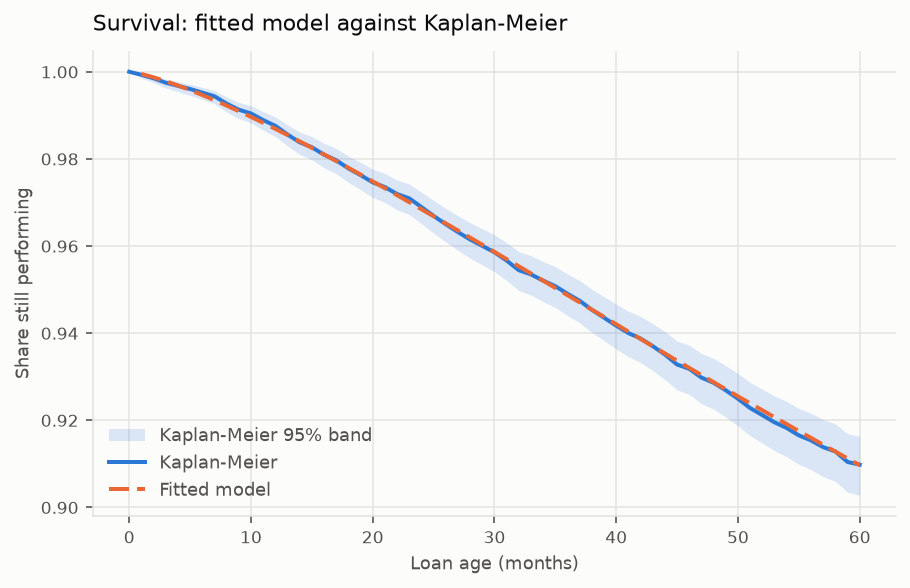

# credit-game

Lifetime PD (probability of default) modelling with **parametric multivariate
survival models**, **time-varying covariates** and **interval censoring**, built on
[lifelines](https://lifelines.readthedocs.io).

Macroeconomic data is real, pulled live from FRED. The loan book is simulated,
because no loan-level survival panel is public without registration — see
[Data honesty](#data-honesty).

---

## The idea

`lifelines` presents three things as mutually exclusive. The documentation steers
time-varying covariates towards `CoxTimeVaryingFitter`, which is semi-parametric,
and presents `fit_interval_censoring` as a one-row-per-subject method.

They combine. On an episode-split panel, passing the interval bounds together with
`entry_col` produces **exactly** the discrete-time likelihood with time-varying
covariates, in a fully parametric model. For an episode covering loan age
`(a, a+1]`:

| Case | `entry` | `lower_bound` | `upper_bound` | Contribution |
|---|---|---|---|---|
| Survived the month | `a` | `a+1` | `inf` | `log S(a+1) + H(a) = log[S(a+1)/S(a)]` |
| Defaulted that month | `a` | `a` | `a+1` | `log[S(a) − S(a+1)] + H(a) = log[1 − S(a+1)/S(a)]` |

The left-truncation term contributes `+H(a)`, so the product over episodes
telescopes to the discrete-observation likelihood. Both rows carry
`event = False`: lifelines uses that flag to mean *the event time is known
exactly*, and monthly reporting tells you the month, never the day. Genuine
interval knowledge is a censored row with finite bounds; right censoring is the
same construct with an infinite upper bound.

**Why parametric matters here.** Lifetime PD needs to extrapolate past the
observation window, respond to macroeconomic scenarios, and produce a smooth term
structure. A Cox model gives none of the three.

---

## Results

Fitted on 10,000 loans and 429,945 loan-months against real FRED history.



| | |
|---|---|
| Fitted curve inside the Kaplan-Meier 95% band | **60 of 60 points** |
| Distribution selected | Weibull, ahead of log-logistic by **ΔAIC 86.5** |
| Shape varies with covariates? | No — LR test p = 0.76 |
| 12-month PD | 0.50% |
| Lifetime PD (60 months) | 3.93% |
| Adverse scenario | **2.73×** baseline lifetime PD |
| Backtest discrimination | Concordance **0.66–0.79** (Gini 0.32–0.58) over four folds |
| Backtest calibration | Actual/expected **1.02–1.37** |

The strongest covariates, as change in 12-month PD per one standard deviation:
mark-to-market leverage **+0.25pp**, credit score **−0.19pp**, unemployment gap
**+0.14pp** — the ordering mortgage credit expects.

**Full reports:** [methodology](reports/methodology.md) ·
[calibration](reports/calibration.md) · [backtesting](reports/backtesting.md) ·
[data dictionary](docs/data_dictionary.md)

---

## Quickstart

```bash
uv sync
uv run creditsurv fetch-macro                          # real FRED data, no API key
uv run creditsurv build-data --n-loans 10000 --seed 42
uv run creditsurv fit
uv run creditsurv compare                              # distribution selection
uv run creditsurv backtest --folds 4 --horizon 24
uv run creditsurv report                               # writes reports/
```

Python ≥3.11 (lifelines requires it); `uv` manages the toolchain.

---

## Layout

```
src/creditsurv/
├── config.py            variables, series, formula — one source of truth
├── data/
│   ├── fred.py          FRED connector, parquet cache, monthly resampling
│   ├── synthetic.py     loan panel driven by real macro; DGP parameters kept
│   ├── panel.py         canonical schema, episode splitting, interval encoding
│   └── store.py         panel persistence
├── features.py          macro covariates, publication lags, coarse classing
├── models/
│   ├── aft.py           parametric AFT, both likelihoods, grouped estimation
│   ├── selection.py     distribution choice and fit quality
│   ├── nonparametric.py Kaplan-Meier and Turnbull benchmarks
│   └── lifetime_pd.py   PD term structure and macro scenarios
├── backtest/            splits, metrics, runner
├── reporting/           charts and generated reports
└── cli.py
```

---

## Data honesty

**The macroeconomic series are real** — unemployment, the Case-Shiller house price
index, the 30-year mortgage rate and the Chicago Fed financial conditions index,
pulled from FRED's public CSV endpoint with no API key.

**The loan book is simulated.** This is a deliberate choice, not a shortcut. No
loan-level survival panel is publicly available without registration. Freddie Mac's
Single-Family Loan-Level Dataset is the right data and sits behind a Clarity
registration. The open alternatives do not work: the Zenodo Lending Club dataset is
a *granting* dataset with a binary flag and no event time, and OpenIntro's is a
single quarterly snapshot. Neither can support a lifetime PD model.

Simulating buys something real. Because the generating process is known — and is
deliberately *the exact estimand the likelihood maximises* — the repository can
assert that the estimator **recovers the true parameters**. A coefficient missing
its confidence interval then indicates a bug, not a misspecified model.

It also produces the financial crisis without being told to. Default rates by
vintage come out at 11–16% for 2005–2008 against 2–5% for benign years, peaking in
2007 — the real pattern, falling out of actual house-price and unemployment history.

---

## Things that did not work

Recorded because a repository that only shows what worked is not much use.

**The generalized gamma nesting test.** The intended centrepiece of model
selection: it nests the exponential, Weibull, gamma, log-normal and inverse-Weibull
families, so one parameter *tests* the family rather than ranking candidates by
AIC. `GeneralizedGammaRegressionFitter` does not converge on this panel under any
remedy tried. The univariate version nominally converges but returns a singular
Hessian — NaN standard errors, and λ = 4.04 where the truth is 1. An unusable test
is worse than no test; selection rests on four weaker but sound layers instead.

**`LogNormalAFTFitter` does not converge** on this panel structure, across sample
sizes, with and without a penalizer, under two optimisers, with truncation on and
off, and with durations rescaled. Weibull and log-logistic fit the identical rows.
The cause was not established — my first hypothesis was wrong — so the behaviour is
recorded without a mechanism and pinned by a strict `xfail`.

**Grouped estimation buys nothing at this dimensionality.** Collapsing identical
episodes into weighted cells is standard practice, so it was implemented and then
measured: 12.7× compression on three binned covariates, and **1.00× on the full
nine**. The cell space grows multiplicatively — 573 billion combinations against
215,000 rows. Coarse classing is kept on its own merits, not as a performance
measure. The equivalence test remains, because being able to show the aggregation
is lossless is worth more than the speed-up it fails to deliver.

**Freezing time-varying covariates** was the recurring bug, in three places. It is
silent, because `cltv_drift` and `unemp_gap` are zero at origination *by
construction*, so freezing them yields a well-behaved curve that assumes house
prices never move. It overstated five-year survival by eight points against
Kaplan-Meier, and left an adverse scenario at 1.04× baseline instead of 1.80×.

---

## Limitations

- **Prepayment is treated as independent censoring.** It is really a competing
  risk — a loan that prepays can never default, and the two share drivers. This
  biases lifetime PD **upward**. Single-risk is a scope decision.
- **FRED serves revisions, not vintages.** Values are as currently restated, not as
  first published, so macro covariates carry mild look-ahead. Point-in-time data
  would need ALFRED. The publication lags partially compensate; they do not
  eliminate it.
- **The unconditional backtest uses a random walk.** We have no vintage-dated macro
  forecasts, so it approximates rather than reconstructs what a forecaster would
  have said.
- **Coefficients describe the generating process**, not the US mortgage market.
- **No LGD or EAD**, so no expected loss. PD only.

---

## Development

```bash
uv run ruff check . && uv run ruff format --check .
uv run mypy                        # strict
uv run pytest -m "not network"     # 128 tests
uv run pytest -m network           # live FRED
```

CI runs lint, format, strict type checking, tests and a packaging build on Python
3.11 and 3.12. Two nightly jobs run the live FRED check and the full pipeline end
to end. ruff does not type-check — it enforces that annotations exist; mypy
verifies they are correct.

## Licence

MIT
