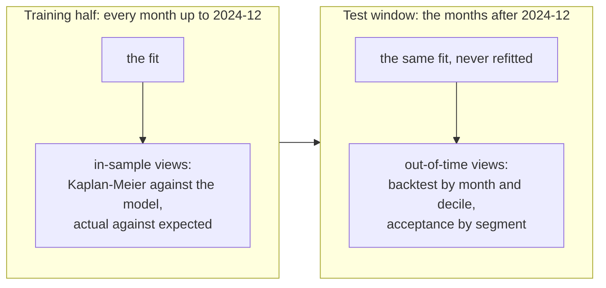

# Calibration & backtest

## In short

| Criterion, declared before the run | Threshold | Out of time | Result |
|---|---|---|---|
| Actual over expected, overall | <!-- value: acceptance.band --> | **<!-- value: backtest.ae -->** | <!-- value: backtest.overall_verdict --> |
| Gini, exposure-weighted | above <!-- value: acceptance.gini --> | **<!-- value: backtest.gini -->** | <!-- value: backtest.gini_verdict --> |
| Actual over expected, every decile | <!-- value: acceptance.band --> | **<!-- value: backtest.deciles -->** | <!-- value: backtest.deciles_verdict --> |

The model <!-- value: backtest.verdict -->. Out of time it was scored on
<!-- value: backtest.loan_months --> loan-months holding <!-- value: backtest.defaults -->
defaults. In sample, actual over expected by calendar year runs from
<!-- value: in_sample.years -->, and a single out-of-time ratio has to be read against that
range rather than against one.

**The cut is in calendar time, not by loan.** Holding out random loans would still train the
model on the months it is judged on, so it would already have seen the economy of the test
window. **Expected defaults** are the model's monthly hazard at each cell's own covariates
times the loan-months the cell stands for; there is no projection. **Above one the model
under-predicts.**

## In sample: non-parametric against parametric

### Kaplan-Meier against the model

Cumulative default by loan age. Kaplan-Meier is the product-limit estimator on the risk sets
of the episodes; the model's curve chains its predicted hazard along each loan's realised
covariate path, over the same risk sets. The two differ only in the hazard they chain.

<!-- figure: km_vs_model -->

Both curves treat prepayment as censoring, so both are the default probability of a loan that
never prepays -- higher than the share of loans that defaulted. The comparison is like for
like; the level is not a lifetime loss rate.

The gap, model minus Kaplan-Meier, in percentage points of cumulative default. Above zero the
model expects more defaults than happened.

<!-- figure: km_deviation -->

??? info "Why there is no in-or-out verdict against the Greenwood band"
    A confidence band narrows as the square root of the sample, and on 48 million loans it
    collapses to a hundredth of a percentage point. Every smooth parametric curve lies outside
    a band that narrow, so the in-or-out test answers a question nobody is asking at this
    size. The size of the gap is the information.

### The hazard by loan age

The monthly default rate at each age, observed and predicted. A family that gets the shape of
the hazard wrong shows it here first, as a gap that grows with age.

<!-- figure: hazard_by_age -->

### Actual against expected

**By calendar year.** The time dimension: a year far from one locates a failure the
cross-section cannot show. The shaded band is the acceptance range.

<!-- figure: ae_by_year -->

**By vintage year.**

<!-- figure: ae_by_vintage -->

**By loan age band.**

<!-- figure: ae_by_age_band -->

**By decile of predicted risk**, observed and expected monthly default rate. Deciles are
slices of equal exposure, not equal numbers of cells.

<!-- figure: ae_by_decile -->

## Out of time: the backtest

**By month**, observed and expected monthly default rate.

<!-- figure: backtest_by_month -->

**Actual over expected by month.**

<!-- figure: backtest_ae_by_month -->

**By decile of predicted risk.** Ranking and level fail independently: a model can order risk
well and still be off in level in every decile.

<!-- figure: backtest_by_decile -->

### The criteria, group by group

The three criteria applied to every group of every segment, with the deciles re-cut within
the group. The criteria were declared for the whole book; a small group failing them is a
place to look, not a second verdict.

<!-- table: acceptance -->

### What moved across the cut

The exposure-weighted mean of each time-varying covariate, month by month.

<!-- figure: covariates_over_time -->

## What the backtest does not measure

!!! warning "The model is granted the economy"
    It is scored on the macro path that actually occurred. A model used in anger has to
    forecast the economy, and its error includes that forecast's error; this isolates the
    credit model. Read as the performance of the whole system it would overstate what the
    system can do.

!!! warning "Prepayment is censoring"
    A loan that prepays leaves the risk set and is not counted against the model. Prepayment
    is a competing risk, and treating it as independent censoring overstates lifetime PD.

!!! note "The macro series are revised, not point-in-time"
    FRED serves the latest vintage of each series, so the covariates carry mild look-ahead
    that the three-month lag only partly offsets.

## Where to read more

- [Backtest report](reports/backtesting.md): generated by `creditsurv report`, with the
  population stability of every covariate across the cut.
- [Methodology report](reports/methodology.md): the family comparison and the shape tests.
