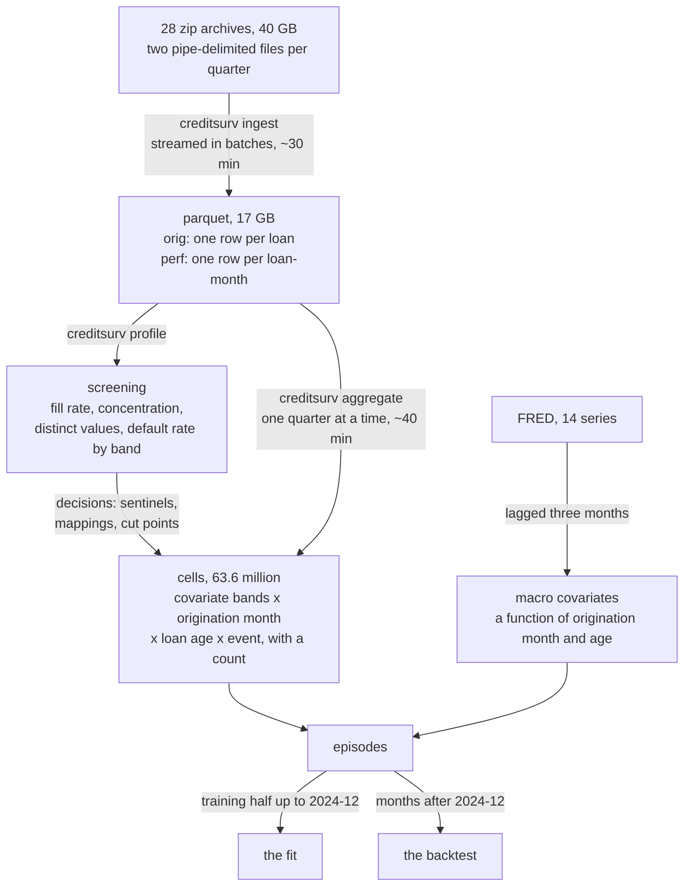
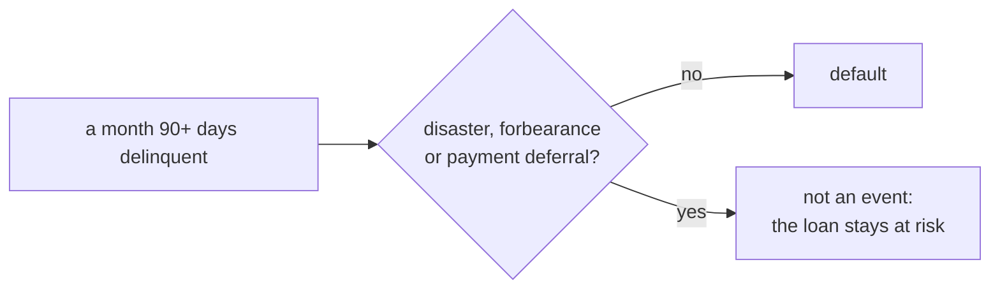

# Data

Two sources. The **Freddie Mac Single-Family Loan-Level Dataset**, Freddie Mac's disclosure
of the fixed-rate single-family mortgages it acquired from 1999, with their monthly
performance; and fourteen monthly **FRED** series, from which every macroeconomic covariate
is built.

## In short

| | |
|---|---|
| Loans | **<!-- value: book.loans -->** |
| Amount originated | <!-- value: book.amount --> |
| Rows in the performance files | <!-- value: book.performance_rows --> |
| Loan-months outstanding | <!-- value: book.loan_months --> |
| Loan-months modelled | **<!-- value: model.loan_months -->** |
| Defaults modelled | **<!-- value: model.defaults -->** |

Three loan-month counts because they count three things: every row the files hold; the
rows reporting a balance at a non-negative age, which is the book outstanding; and the
months the model is estimated on, up to each loan's first terminating month, of loans
whose credit score, loan-to-value and debt-to-income are known and whose every code is
mapped.

## From archives to a fittable table

**Episodes that agree on every covariate and on their position in time are exchangeable**,
so they collapse into one row carrying a count, which the likelihood reads as a frequency
weight. A macro covariate is a function of the origination month and the loan age, both
already in the key, so it costs no cells; a loan covariate multiplies the table by what it
actually costs, which is measured before it is admitted.

| Layer | One row is |
|---|---|
| 1. Raw macro | one month of one economic series |
| 2. Origination record | one loan, as underwritten |
| 3. Performance record | one loan in one calendar month |
| 4. Weighted cell | a covariate combination at one age, with a count |
| 5. Model matrix | one episode, carrying that count as a weight |

## What counts as a default

| Outcome | Condition |
|---|---|
| **Default** | 90 or more days delinquent, **or** a zero balance by third-party sale, short sale, REO or note sale, unless the month is a moratorium |
| **Censored** | prepaid (code 01), reperforming loan sale (16), removal (96) |
| **End of observation** | a modification, the month before it |

**A moratorium is not a default.** CARES Act forbearance had to be reported as delinquency,
and had made up 17% of the default events. Under the `exclude` policy, chosen by a rule
written before either fit, the accommodated month is not an event and a later genuine
default still counts. The May 2020 default rate fell from 90.4 to 2.00 basis points.

??? info "Why `exclude` and not `censor`"
    Forbearance went to the borrowers who asked for it, on the whole those under strain, so
    ending their observation at the first accommodated month removes loans because of their
    risk: informative censoring, biasing the hazard down. The data could overturn that prior
    only through the backtest. Neither policy failed a criterion the other passed, and
    censoring lost 26% of the test window's defaults. See
    [the moratorium report](reports/moratorium.md) and
    [data preparation](data_preparation.md#a-moratorium-is-not-a-default).

## What is out of scope

| Left out | Why | How much |
|---|---|---|
| **HARP refinances** | Freddie Mac reports no debt-to-income for them, and the complete-case rule drops a loan missing a covariate rather than imputing it | 18% of the 2009Q2 to 2019Q1 vintages, about three times as likely to default as the loans kept |
| Other incomplete cases | a missing credit score, loan-to-value or debt-to-income, or a code no mapping covers | see [what dropping removes](data_preparation.md#what-dropping-removes) |
| Months after a modification | `loan_age` restarts at a modification, so the loan is censored there | -- |
| Loans outside the agency, fixed-rate, US perimeter | not in the dataset | a bank's portfolio would need its own calibration |

!!! warning "HARP is the largest gap"
    Covering it takes a level of its own in the cell key -- a re-aggregation and a new
    selection -- never an imputed debt-to-income.

??? info "Rules that are silent when broken"
    - **Missing-value sentinels are real numbers**: 9999 for credit score, 999 for
      loan-to-value, debt-to-income and estimated loan-to-value. The median estimated
      loan-to-value of the 2006 vintage is literally 999.
    - **Categorical mappings have no `ELSE` branch.** An unmapped code becomes null and the
      loan is dropped, rather than folded into whichever level was written last.
    - **Truncation orders by calendar period, not by loan age**, because age restarts at a
      modification. Ordering by age lost 641 real defaults on 2006Q1.
    - **Every macro series is lagged three months**, market quotes included: a loan 90 days
      delinquent in a month missed its payments in the three before it.
    - **The weight is a count of loan-months, never an amount**: PD is per obligor.

## Where to read more

- [Data dictionary](data_dictionary.md): the record layout, layer by layer, and a real loan
  traced through all five.
- [Data preparation](data_preparation.md): 40 GB to a fittable table, with every
  measurement behind the choices.
- [The moratorium decision](reports/moratorium.md): the two event definitions, fitted and
  backtested side by side.
