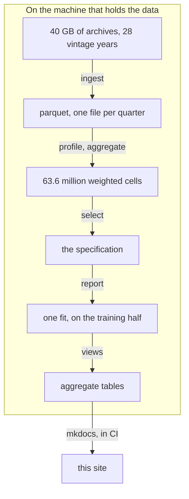

# Lifetime PD on the whole Freddie Mac book

A lifetime probability of default estimated with **parametric survival models**,
**time-varying covariates** and **interval censoring**, on every loan of the Freddie Mac
Single-Family Loan-Level Dataset, with macroeconomic covariates from FRED. No sampling.

## In short

| | |
|---|---|
| Loans, 1999 to 2026 | **<!-- value: book.loans -->** |
| Amount originated | <!-- value: book.amount --> |
| Loan-months modelled | **<!-- value: model.loan_months -->** |
| Defaults modelled | **<!-- value: model.defaults -->** |
| Out-of-time actual over expected | **<!-- value: backtest.ae -->**, accepted from <!-- value: acceptance.band --> |
| Out-of-time Gini | **<!-- value: backtest.gini -->**, accepted above <!-- value: acceptance.gini --> |
| Actual over expected, decile by decile | <!-- value: backtest.deciles --> |
| Adverse lifetime PD against baseline | **<!-- value: scenario.multiple -->** |

The model <!-- value: backtest.verdict --> declared before the backtest ran: it
<!-- value: backtest.overall_verdict --> on the overall ratio, <!-- value: backtest.gini_verdict -->
on the Gini and <!-- value: backtest.deciles_verdict --> decile by decile. The figures on this
site are all drawn from one fit, <!-- value: views.fit -->, and were generated
<!-- value: views.generated -->.

## The idea in one table

On an episode-split panel, lifelines' interval-censored likelihood with left truncation is
**exactly** the discrete-time likelihood with time-varying covariates, in a fully parametric
model. For an episode covering loan age `(a, b]`:

| Case | `entry` | `lower` | `upper` | Contribution |
|---|---|---|---|---|
| Survived the interval | `a` | `b` | `inf` | `log S(b) - log S(a)` |
| Defaulted in it | `a` | `a` | `b` | `log[1 - S(b)/S(a)]` |

The truncation term makes each contribution conditional on surviving to `a`, and the product
over episodes telescopes into the likelihood of the monthly observations. A parametric model
is what lifetime PD needs: it extrapolates past the observation window, responds to a
macroeconomic scenario and gives a smooth term structure, and a Cox model gives none of the
three.

## Reading the site

| Section | What it answers |
|---|---|
| [Data](data.md) | Where the loans come from, what counts as a default, which loans are out of scope |
| [Portfolio](portfolio.md) | What was lent, when, to whom, and how it performed, by segment |
| [Methodology](methodology.md) | How episodes are encoded, how the covariates were selected, how the fit runs |
| [Model](model.md) | The specification, what each covariate is worth, the term structure and the scenarios |
| [Calibration & backtest](calibration.md) | Kaplan-Meier against the model, actual against expected, in sample and out of time |
| [Validation response](validation.md) | Each finding of the independent validation, what changed, and the evidence |
| [Decision log](decisions.md) | The choices made, the alternatives rejected, and what was retracted |
| [Reproduce](reproduce.md) | The commands, what each costs on a laptop, and the constraints behind them |

Every figure has a menu: pick a segment -- credit score band, loan-to-value band, purpose,
occupancy, vintage era -- and the figure shows one curve per group. Points resting on fewer
than <!-- value: figures.floor --> loan-months are not drawn.

!!! note "What is published"
    Only aggregates. The tables behind the figures are computed locally by
    `creditsurv views` and committed; no loan-level record leaves the machine they were
    computed on, as the Freddie Mac terms of use require.
