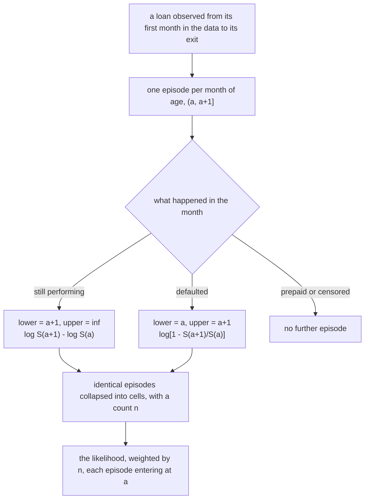
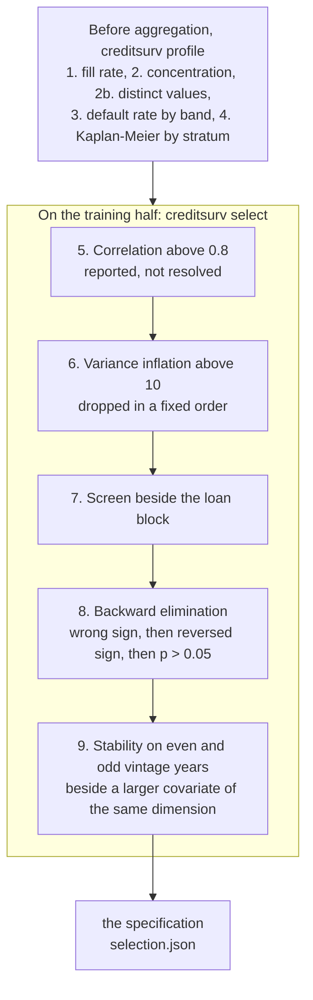
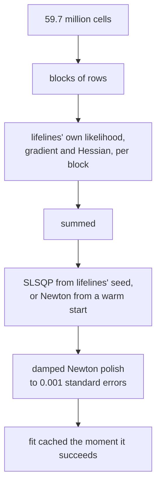

# Methodology

## In short

- **The model** is an accelerated failure time model, Weibull, with time-varying covariates,
  estimated by maximum likelihood on **monthly episodes** under interval censoring with left
  truncation.
- **The unit** is the weighted cell: episodes that agree on every covariate and on their
  position in time, collapsed into one row with a count.
- **The specification is an output.** `creditsurv select` runs steps 5 to 9 of a written
  procedure on the training half, and a test fails when the configuration and its record
  part.
- **The hazard rises with loan age**: the Weibull shape is <!-- value: model.rho -->, and the
  test of a constant hazard has z = <!-- value: model.rho_z -->.
- **The fit runs block by block** on lifelines' own likelihood, and is polished with damped
  Newton steps to the optimum lifelines' optimiser stops short of.

## From a loan to the likelihood

Every episode enters at its start age, so its contribution is conditional on having survived
to it, and a loan that entered the data late is at risk only from the age it was first
observed. A covariate may change from one episode to the next: the macro covariates are
functions of the calendar month, the loan-to-value drift of the house price index since
origination.

**The weight is a count of loan-months, never an amount.** PD is defined per obligor, so a
$2m loan and a $200k loan each contribute one default; weighting by balance would estimate a
different quantity under the same name.

??? info "Why a parametric model and not Cox"
    Lifetime PD needs three things a Cox model does not give. **Extrapolation** past the
    observation window: a Cox baseline is defined only where events were observed. **A
    response to scenarios**: the hazard has to be evaluated at covariate values that have not
    occurred. **A smooth term structure**: a step function is an awkward basis for a monthly
    loss forecast. The price is an assumption about the shape of the baseline hazard, which is
    what the family comparison below tests.

## How the covariates were chosen

Two inputs are fixed before any fit and must stay so: the order in which variance inflation
removes covariates, and the economic dimension of every candidate. Changed after the results,
either becomes a way of dropping whatever came out inconvenient. The selection never sees the
test window.

**At this scale every p-value is zero**, so the univariate screen and the p-value arm of the
elimination are inert. Discrimination comes from the sign, from a sign that reverses between
the covariate alone and the covariate in the model, and from stability across samples.

### What each step removed

**Correlation** between the continuous candidates, weighted by exposure.

<!-- figure: selection_correlation -->

**Variance inflation.**

<!-- table: selection_inflation -->

**Screening** beside the loan block: the effect of one standard deviation on log survival
time, and whether its sign is the one declared before the run.

<!-- figure: selection_screening -->

**Backward elimination**, one covariate a step, with the rule that fired.

<!-- table: selection_elimination -->

**Stability**: the effect of one standard deviation on the whole training half and on loans
originated in even and in odd years, round by round.

<!-- figure: selection_stability -->

??? info "What `nmds` would have done differently"
    It too would have removed *equity volatility* (`equity_volatility`) and *volatility change since origination* (`volatility_change`) on their signs. It would have kept
    *mortgage rate fall since origination* (`mortgage_rate_decline`), *inflation* (`inflation_rate`) and *equity return* (`equity_return`), which have no declared prior and meet no rule
    of its, and *yield curve slope* (`yield_curve_slope`) and *house price growth* (`house_price_growth`), since it has no stability step. The reversal
    and stability rules are this project's additions, argued in
    [variable selection](variable_selection.md).

## The distribution family

<!-- figure: families_vs_km -->

The Weibull and the log-logistic, each fitted to the same specification on the same
episodes, chained along the loans' realised covariate paths, against Kaplan-Meier with its
Greenwood band. The band is a hundredth of a percentage point wide on 48 million loans, so
every smooth curve lies outside it: what carries information is the size of the gap.

On the selected specification the log-logistic has the better likelihood and sits slightly
closer to Kaplan-Meier, but turns *financial conditions* (`financial_conditions`) against its declared prior. **The Weibull is kept for now**: changing the
family is a new selection, not a swap, because every rule in steps 8 and 9 reads the
family's coefficients; the gain against Kaplan-Meier is small; and the log-logistic's
falling hazard at long ages is an extrapolation choice that should be made for its own sake.
The reasoning, with the numbers, is in [variable
selection](variable_selection.md#the-distribution-family-and-why-the-weibull-was-kept-against-a-better-likelihood).

!!! warning "Identification"
    `period = cohort + age` holds identically, so no two of calendar time, vintage and loan
    age can be held fixed while the third moves. The shape of the baseline hazard is
    identified only under the restriction that calendar time enters through a few macro
    covariates rather than as a free period effect. Which family fits cannot be separated
    from which covariates are in the model.

**One shape for every loan.** Investor loans default faster early and slower late, so their
survival curves cross those of owner-occupied loans, which no scale factor reconciles. A
likelihood ratio test on a shape that varies with occupancy rejects the common shape; on 60
million episodes every such test does, and whether the difference matters for lifetime PD is
read in the [calibration by segment](calibration.md).

## The estimation engine

- **Memory decides what can be fitted.** A stock lifelines fit holds about 680 bytes a row of
  autograd tape and design copies, 45 to 50 GB here. The block engine evaluates the same
  likelihood a block at a time, and the test suite holds it to lifelines' coefficients,
  standard errors and log-likelihood.
- **lifelines' optimiser stops short.** It stops on a change in the *mean* log-likelihood,
  which takes no account of how precisely the data pin a coefficient down: on four quarters
  of the book it stopped up to 5.9 standard errors from the maximum. Every fit is polished.
- **The polish is damped.** lifelines clips the interval probability, so far from the data
  the objective goes negative and flat, and an undamped step once landed there. A step is
  taken only to a value a likelihood can have, damped until it lowers the objective.

## Where to read more

- [Variable selection](variable_selection.md): the procedure, the results on the training
  half, the covariates given up, and the first run with its retraction.
- [The selection record](reports/selection.md): generated by `creditsurv select`.
- [Methodology report](reports/methodology.md): generated by `creditsurv report`; the shape
  tests, the family comparison and the fit against Kaplan-Meier.
