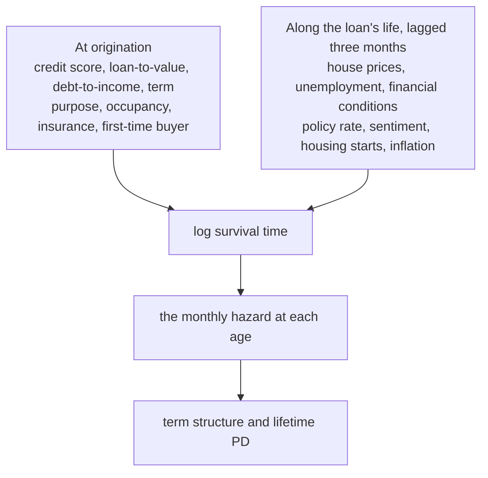

# Model

## In short

| | |
|---|---|
| Family | Weibull accelerated failure time, shape <!-- value: model.rho --> |
| Twelve-month PD, origination book today | **<!-- value: scenario.pd_12m -->** |
| Lifetime PD over 36 months, baseline | <!-- value: scenario.baseline --> |
| Lifetime PD over 36 months, adverse | <!-- value: scenario.adverse --> |
| Adverse against baseline | **<!-- value: scenario.multiple -->** |

## Reading a coefficient

This is an **accelerated failure time** model: a coefficient acts on the logarithm of
survival *time*. **Positive lengthens survival and lowers risk.** `exp(coef)` is a time ratio,
not a hazard ratio; reading it as one inverts every conclusion.

Coefficients are not comparable across covariates measured in different units, so the
continuous ones are shown as the effect of one standard deviation, exposure-weighted on the
training half. The categorical ones are each level against its reference.

<!-- figure: coefficients -->

??? abstract "Every coefficient, with its standard error and interval"
    <!-- table: coefficients -->

??? warning "Three readings to hold loosely"
    - `nfci_lagged` is right-signed and stable across samples, and nearly nothing: in a
      stress scenario it contributes its sign and little else.
    - `policy_rate_gap` has no declared prior. A policy rate below where the loan was written
      shortens survival, which reads as the central bank cutting into recessions rather than
      as a payment channel a fixed-rate mortgage does not have.
    - Housing carries two covariates, the position (`cltv_drift`) and the construction cycle
      (`starts_growth`). The stability step separates a pair only when the smaller one
      changes sign, and neither did.

## The term structure

Cumulative PD month by month for the origination book dated to today -- the commonest
origination profiles, each weighted by the lending it stands for -- on the baseline path, by
segment.

<!-- figure: term_structure -->

Two portfolios can share a lifetime PD and differ entirely here, and the difference decides
when losses arrive.

## Scenarios

The adverse path is shaped like 2008 rather than scaled to it, and it moves only the series
the model reads. The baseline is a random walk from the last observation: **not a forecast**,
but what makes the relative effect of a scenario readable without a view on the economy.

<!-- table: adverse_legs -->

Because the covariates are time-varying, a scenario is applied by projecting the covariate
paths from today and chaining the conditional survival, not by rescoring frozen covariates.

<!-- figure: scenarios -->

??? abstract "Scenarios by segment, as a table"
    <!-- table: scenario_summary -->

!!! warning "What these PDs are not"
    **Prepayment is treated as independent censoring**, so a loan that prepays is assumed to
    have gone on defaulting at the model's hazard. Prepayment is a competing risk, and
    ignoring it overstates lifetime PD, most at long horizons. There is no LGD or EAD, so no
    expected loss.

## Where to read more

- [Calibration report](reports/calibration.md): generated by `creditsurv report`; marginal
  effects on twelve-month PD, and the distribution of lifetime PD under each scenario.
- [Calibration & backtest](calibration.md): whether the hazard behind these numbers matches
  what happened.
