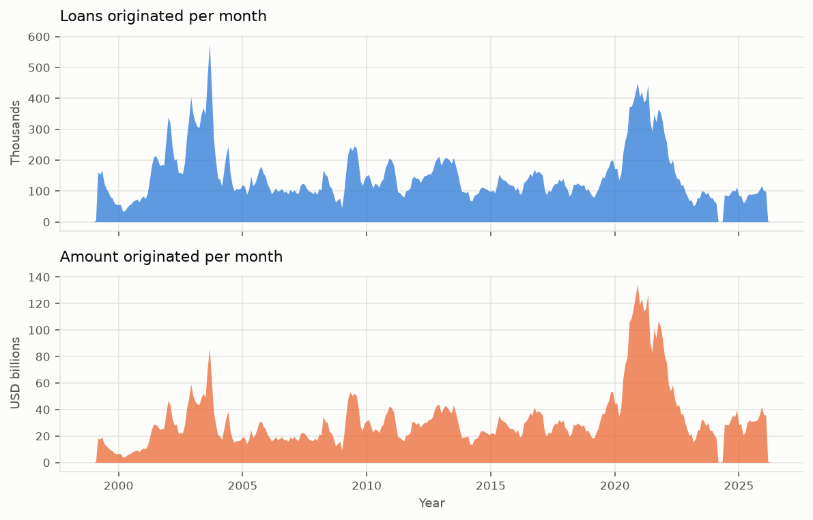
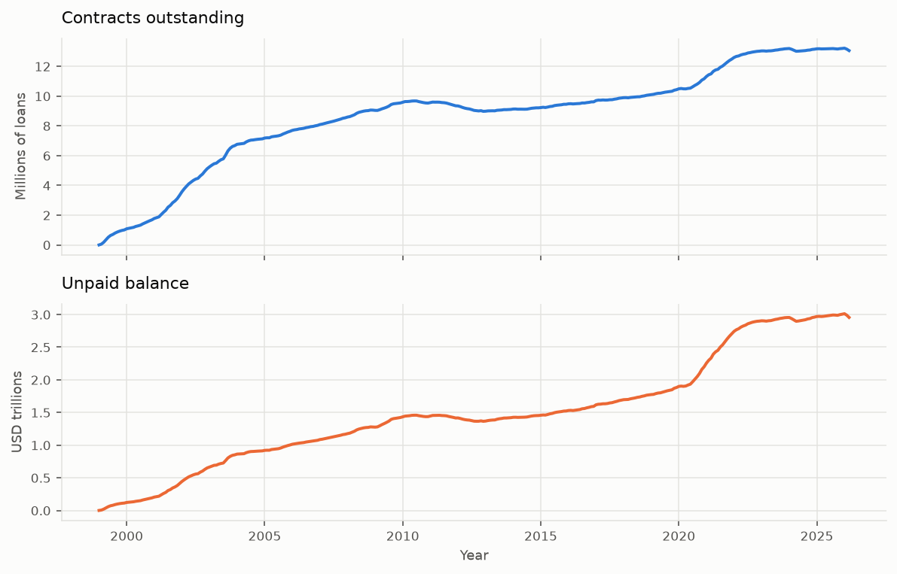
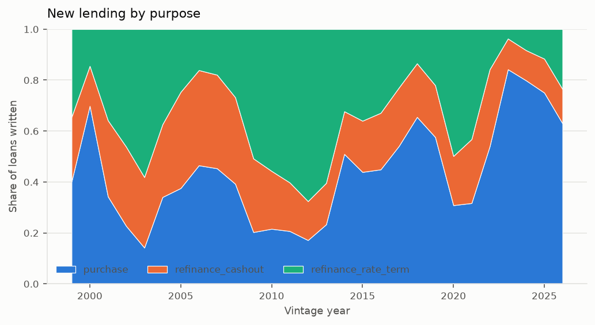
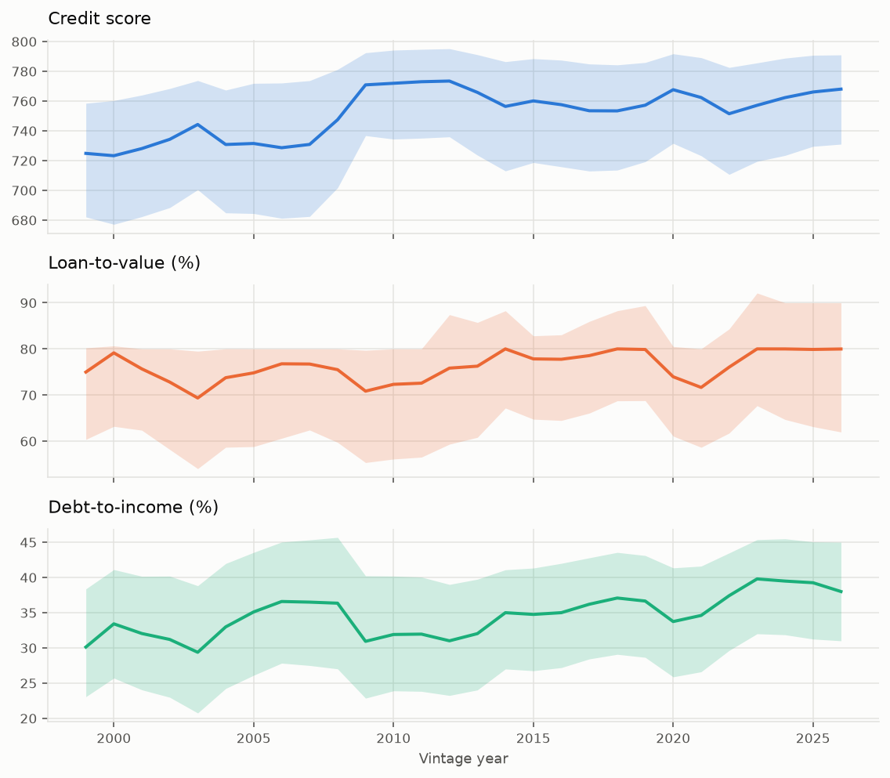
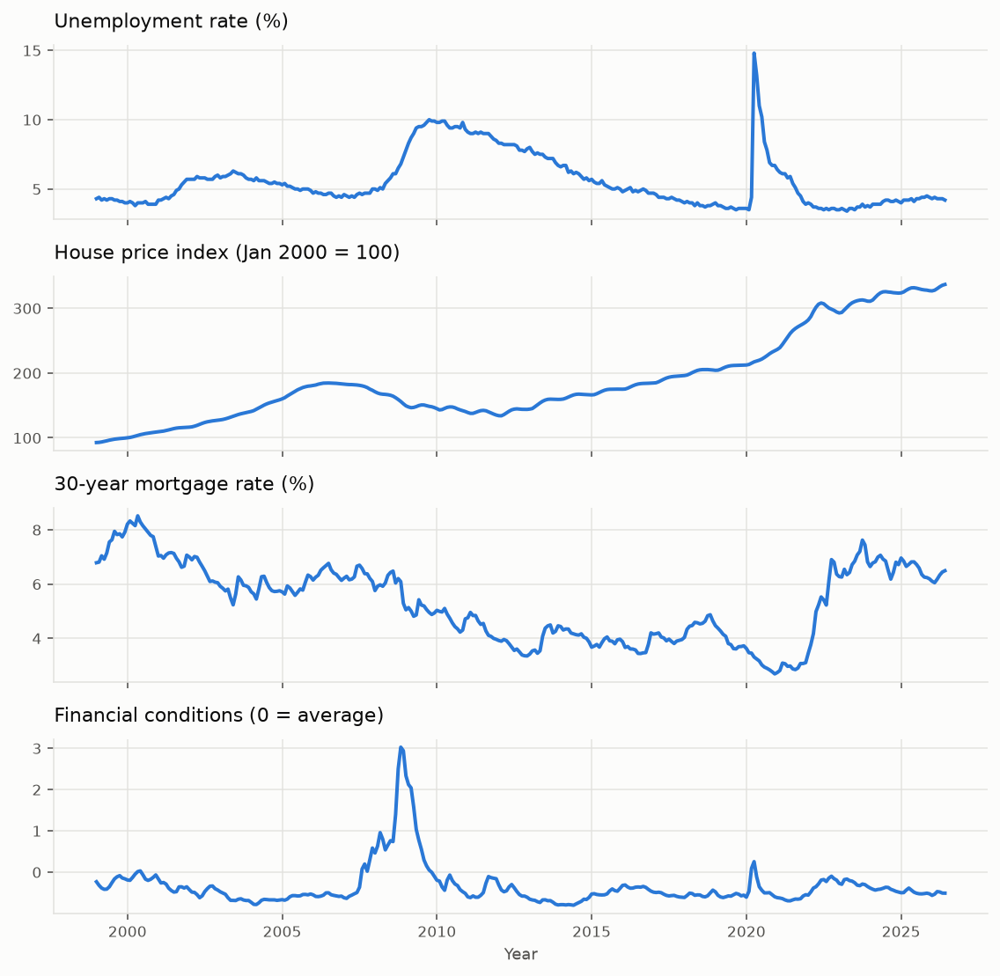

# The portfolio

What the book looks like, before any model is fitted to it. Read
[data_dictionary.md](data_dictionary.md) for what the fields mean and
[data_preparation.md](data_preparation.md) for how the data gets here; this document
is about the loans themselves.

A model is easier to trust once the reader has seen the portfolio it was estimated
on. None of what follows is modelling — it is the description that makes the
modelling legible, and it is also where several problems were found that no amount of
staring at coefficients would have surfaced.

## The book in one table

| | |
|---|---|
| Vintages | 1999 – 2026 |
| Loans originated | **48,827,197** |
| Amount originated | **$10.51 trillion** |
| Loan-months observed | **2,876,284,955** |
| Peak contracts outstanding | **13,220,705** |
| Peak balance outstanding | **$3.01 trillion** |
| Defaults observed | 1,906,460 |

## New lending



Two panels rather than two y-axes: a count and a currency amount share no scale, and
a dual axis would let the choice of scales decide how related they look.

The series is the US mortgage market's own history, and it is worth reading before
trusting any model fitted across it:

- **2003** — the refinancing boom. September 2003 alone writes **576,869 loans**, the
  busiest month in the dataset, as the 30-year rate reaches its then-lowest point.
- **2004–2008** — volumes fall by two thirds as rates rise, then the crisis.
- **2009–2012** — a second refinancing wave, on much tighter underwriting.
- **2020–2021** — the largest by amount: **4,391,112 loans and $1.27 trillion in 2021**,
  at the lowest rates in the series.
- **2022–2024** — the sharpest contraction in the dataset, as rates rise again.

Any model estimated on this data is estimating across four distinct lending regimes.
That is the argument for time-varying covariates rather than a vintage dummy.

## The book outstanding



Contracts outstanding peak at 13.2 million and balance at $3.01 trillion. The two do
not peak together, because the average loan has grown: the same balance is carried by
fewer, larger loans over time.

## What was written, and when



The mix moves a great deal, which is the reason a model fitted on one decade can
mislead about another.

| Share of new lending | 2003 | 2021 |
|---|---|---|
| Purchase | 14.2% | **31.7%** |
| Cash-out refinance | 27.7% | 25.1% |
| Rate-and-term refinance | **58.1%** | 43.2% |

2003 is a refinancing market with purchases as a minority; 2021, despite being a
refinancing boom by volume, is a third purchases.

### A finding this view produced

`channel` **cannot be used at four levels**, and only the time series shows why:

| Share of new lending | 1999 | 2003 | 2008 | 2009 | 2021 |
|---|---|---|---|---|---|
| Retail | 53.8% | 58.1% | 50.4% | 58.2% | 57.9% |
| Third party, not specified (`T`) | **46.1%** | **41.7%** | 31.2% | **0.0%** | **0.0%** |
| Broker (`B`) | 0.0% | 0.1% | 7.2% | 16.6% | 13.4% |
| Correspondent (`C`) | 0.1% | 0.1% | 11.2% | 25.2% | 28.6% |

Until 2008 roughly half of originations are coded `T`; from 2009 it vanishes and
broker and correspondent absorb it entirely. **That is a change in how Freddie Mac
coded the field, not in how loans were sold.** A model given the four levels would
read the coding change as a risk effect — a category that disappears in 2009 and
another that appears.

Retail's own share is stable across the whole history, so the field is collapsed to
**retail against third-party**, which is the part that means the same thing in every
vintage.

## Underwriting, and how it drifted



Median with interquartile band, so distribution and drift are in one figure: the band
is who was being lent to, the line is the middle of the book.

| Vintage | Credit score (median) | LTV (median) | DTI (median) |
|---|---|---|---|
| 1999 | 724.8 | 75.0 | 30.1 |
| 2003 | 733.2 | 65.7 | 31.2 |

The credit score distribution moves upward and its spread narrows after 2008 —
underwriting tightened, and the book being written changed with it. This is exactly
the population shift that makes an out-of-time backtest meaningful and an in-sample
fit misleading.

## The economy the loans lived through



Four series, one panel each, all real and pulled from FRED with no API key:
unemployment, the Case-Shiller national house price index, the 30-year mortgage rate,
and the Chicago Fed financial conditions index. See
[data_dictionary.md](data_dictionary.md) for what each one is and how it is lagged.

These are not background. `unemp_gap`, `cltv_drift` and `nfci_lagged` are built from
them, and they are what let a single model span 1999 to 2026 without a vintage dummy
absorbing the very effects it is supposed to estimate.

## Reproducing

```bash
uv run creditsurv fetch-macro
uv run creditsurv ingest
uv run creditsurv portfolio          # writes the figures in this document
```
