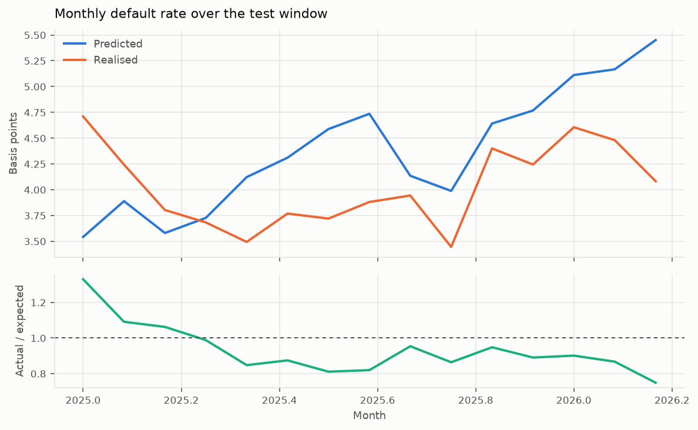
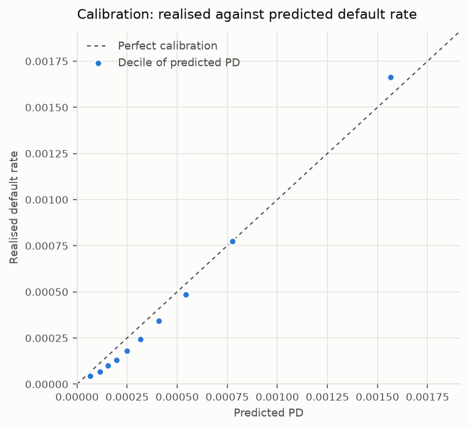

# Backtesting

*Generated by `creditsurv report`. Numbers come from the run, not the prose.*

## What is being tested

One cut, in calendar time, at **2024-12**. Everything observed at or before it
fits the model; everything after it judges it. There is no second fit anywhere in this
report — the model scored below is the same one the methodology and calibration
reports describe, and it has never seen a month of the test window.

That is a deliberate narrowing. An earlier version refitted at several reporting dates
and again under two macroeconomic assumptions, which answers a richer question at a
cost of eight fits; on this panel a fit is hours rather than seconds, and the richer
question was not the one being asked.

**Why the cut is in calendar time and not by loan.** Holding out random loans still
trains the model on the calendar periods it is about to be judged on, so it has
already seen the macro conditions of the test window. That is look-ahead even though
no loan appears on both sides of the line, and it flatters the result exactly where
the model is weakest — in the downturns nobody had seen yet.

**The cut is late on purpose.** A credit model wants every loan-month it can get, and
holding back a decade to see the same answer at four dates is a poor trade.

**Exposure either side of the reporting date**

| as_of | train_loan_months | train_defaults | train_rows | test_loan_months | test_defaults | test_rows |
|---|---|---|---|---|---|---|
| 2024-12 | 2345846897 | 1460306 | 59663961 | 189347228 | 76380 | 3975155 |

## Predicted against realised

Expected defaults are the sum of the model's monthly hazard times the loan-months
each cell stands for. Actual defaults are the loan-months the data records as ending
in default. The ratio is the number a credit committee reads: **above one the model
under-predicted**, below one it over-predicted.

There is no forward projection. A cell already records what its loans looked like in
the month it covers, so the prediction is evaluated there — which is simpler than
projecting a book forward and closer to the question being asked.

- **loan-months scored**: 189,347,228
- **expected defaults**: 83,029
- **actual defaults**: 76,380
- **actual / expected**: 0.9199
- **Gini (exposure-weighted)**: 0.5606

## Acceptance

The criteria below were **declared before the backtest ran**, and they are what makes this
section a test rather than a description: a backtest with no criterion can be read, but
not passed or failed. They are the independent validation's proposal, adopted as they
stand rather than tuned to a result. On this run the in-sample years range from 0.47 to 1.60, and the out-of-time figure has to be read against that range rather than against one.

On them, the model **does not pass**.

| criterion | threshold | value | passed |
|---|---|---|---|
| actual / expected, overall | 0.80 to 1.25 | 0.9199 | True |
| Gini, exposure-weighted | above 0.45 | 0.5606 | True |
| actual / expected, every decile | 0.80 to 1.25 | 0.598 to 1.064 | False |

## In-sample, by year

Predicted against realised on the data the model was fitted to, one row per calendar
year. It belongs beside the out-of-time result. A model whose in-sample years swing widely
cannot be called calibrated because one out-of-time figure lands near one; and a year far
from one here locates a failure in the time dimension of the model, which the
cross-section by decile cannot show.

| group | expected | events | exposure | expected_rate | actual_rate | actual_over_expected |
|---|---|---|---|---|---|---|
| 1999 | 1557.2911 | 733.0000 | 6.9e+06 | 0.0002 | 0.0001 | 0.4707 |
| 2000 | 4784.4621 | 5078.0000 | 1.57e+07 | 0.0003 | 0.0003 | 1.0614 |
| 2001 | 12133.4047 | 15622.0000 | 2.89e+07 | 0.0004 | 0.0005 | 1.2875 |
| 2002 | 27170.4820 | 27311.0000 | 5.16e+07 | 0.0005 | 0.0005 | 1.0052 |
| 2003 | 30409.9403 | 36524.0000 | 7.09e+07 | 0.0004 | 0.0005 | 1.2011 |
| 2004 | 27846.1229 | 34465.0000 | 8.22e+07 | 0.0003 | 0.0004 | 1.2377 |
| 2005 | 26383.3891 | 42159.0000 | 8.66e+07 | 0.0003 | 0.0005 | 1.5979 |
| 2006 | 29305.8984 | 37347.0000 | 9.19e+07 | 0.0003 | 0.0004 | 1.2744 |
| 2007 | 41813.3664 | 50230.0000 | 9.69e+07 | 0.0004 | 0.0005 | 1.2013 |
| 2008 | 88093.6932 | 102677.0000 | 1.03e+08 | 0.0009 | 0.0010 | 1.1655 |
| 2009 | 219906.9680 | 220702.0000 | 1.07e+08 | 0.0021 | 0.0021 | 1.0036 |
| 2010 | 152311.0862 | 185679.0000 | 1.05e+08 | 0.0014 | 0.0018 | 1.2191 |
| 2011 | 148117.8367 | 129907.0000 | 9.75e+07 | 0.0015 | 0.0013 | 0.8771 |
| 2012 | 106362.5151 | 98649.0000 | 8.83e+07 | 0.0012 | 0.0011 | 0.9275 |
| 2013 | 67224.4520 | 63306.0000 | 8.11e+07 | 0.0008 | 0.0008 | 0.9417 |
| 2014 | 53496.1842 | 44255.0000 | 8.01e+07 | 0.0007 | 0.0006 | 0.8273 |
| 2015 | 43460.3034 | 32731.0000 | 8.36e+07 | 0.0005 | 0.0004 | 0.7531 |
| 2016 | 40029.0407 | 28692.0000 | 8.81e+07 | 0.0005 | 0.0003 | 0.7168 |
| 2017 | 34916.0960 | 30322.0000 | 9.32e+07 | 0.0004 | 0.0003 | 0.8684 |
| 2018 | 32090.4056 | 32404.0000 | 9.79e+07 | 0.0003 | 0.0003 | 1.0098 |
| 2019 | 36428.4737 | 30618.0000 | 1.04e+08 | 0.0004 | 0.0003 | 0.8405 |
| 2020 | 59394.6947 | 32490.0000 | 1.14e+08 | 0.0005 | 0.0003 | 0.5470 |
| 2021 | 43638.2957 | 36332.0000 | 1.32e+08 | 0.0003 | 0.0003 | 0.8326 |
| 2022 | 41135.7542 | 39249.0000 | 1.44e+08 | 0.0003 | 0.0003 | 0.9541 |
| 2023 | 45121.5400 | 45417.0000 | 1.47e+08 | 0.0003 | 0.0003 | 1.0065 |
| 2024 | 46828.0877 | 57407.0000 | 1.49e+08 | 0.0003 | 0.0004 | 1.2259 |

**By month of observation**

| group | expected | events | exposure | expected_rate | actual_rate | actual_over_expected |
|---|---|---|---|---|---|---|
| 2025-01 | 4455.354079 | 5925.000000 | 1.26e+07 | 0.000354 | 0.000471 | 1.329861 |
| 2025-02 | 4893.495160 | 5339.000000 | 1.26e+07 | 0.000389 | 0.000424 | 1.091040 |
| 2025-03 | 4506.965586 | 4788.000000 | 1.26e+07 | 0.000358 | 0.000380 | 1.062356 |
| 2025-04 | 4695.047083 | 4640.000000 | 1.26e+07 | 0.000373 | 0.000368 | 0.988275 |
| 2025-05 | 5197.340154 | 4405.000000 | 1.26e+07 | 0.000412 | 0.000349 | 0.847549 |
| 2025-06 | 5437.894484 | 4754.000000 | 1.26e+07 | 0.000431 | 0.000377 | 0.874235 |
| 2025-07 | 5791.915574 | 4696.000000 | 1.26e+07 | 0.000459 | 0.000372 | 0.810785 |
| 2025-08 | 5980.785510 | 4901.000000 | 1.26e+07 | 0.000474 | 0.000388 | 0.819458 |
| 2025-09 | 5219.808824 | 4978.000000 | 1.26e+07 | 0.000414 | 0.000394 | 0.953675 |
| 2025-10 | 5039.286752 | 4353.000000 | 1.26e+07 | 0.000399 | 0.000345 | 0.863813 |
| 2025-11 | 5863.886450 | 5559.000000 | 1.26e+07 | 0.000464 | 0.000440 | 0.948006 |
| 2025-12 | 6033.268824 | 5371.000000 | 1.27e+07 | 0.000477 | 0.000424 | 0.890231 |
| 2026-01 | 6470.362763 | 5830.000000 | 1.27e+07 | 0.000511 | 0.000461 | 0.901031 |
| 2026-02 | 6541.669246 | 5672.000000 | 1.27e+07 | 0.000517 | 0.000448 | 0.867057 |
| 2026-03 | 6901.747421 | 5169.000000 | 1.27e+07 | 0.000545 | 0.000408 | 0.748941 |

## Calibration by decile of predicted risk

Buckets are quantiles of **exposure**, not of rows, so each holds a comparable slice
of the book rather than a comparable number of cells — which would be a property of
the binning rather than of the portfolio.

A model can be excellent here and useless at ranking, or the reverse. Both are
reported because they fail independently.

| bucket | loan_months | events | expected | actual | difference | ratio |
|---|---|---|---|---|---|---|
| 0 | 1.89e+07 | 856.000000 | 6.62e-05 | 4.52e-05 | -2.1e-05 | 0.682796 |
| 1 | 1.89e+07 | 1285.000000 | 0.000113 | 6.79e-05 | -4.56e-05 | 0.597947 |
| 2 | 1.89e+07 | 1877.000000 | 0.000153 | 9.91e-05 | -5.42e-05 | 0.646487 |
| 3 | 1.89e+07 | 2492.000000 | 0.000196 | 0.000132 | -6.48e-05 | 0.669981 |
| 4 | 1.89e+07 | 3387.000000 | 0.000248 | 0.000179 | -6.94e-05 | 0.720533 |
| 5 | 1.89e+07 | 4594.000000 | 0.000316 | 0.000243 | -7.3e-05 | 0.768794 |
| 6 | 1.89e+07 | 6517.000000 | 0.000408 | 0.000344 | -6.42e-05 | 0.842829 |
| 7 | 1.89e+07 | 9203.000000 | 0.000544 | 0.000486 | -5.82e-05 | 0.893113 |
| 8 | 1.89e+07 | 14669.000000 | 0.000775 | 0.000775 | -7.64e-07 | 0.999015 |
| 9 | 1.89e+07 | 31500.000000 | 0.001564 | 0.001664 | 0.0001 | 1.063945 |

## Discrimination

**Gini 0.5606**, from the exposure-weighted Lorenz curve.

A concordance index is not available and the substitution is not a convenience: the
index needs pairs of *subjects*, and an aggregated cell is not a subject. The Lorenz
construction asks the equivalent question of the data that does exist — order the
cells by predicted risk and see how much realised default falls in the riskiest slice
of exposure — and lands on the same zero-to-one scale.

What is genuinely lost is the ability to say the model ranks *loans*. It ranks
exposure, which is what an aggregated panel can support.

## Population stability

How far each covariate's distribution moved across the cut, weighted by exposure.

The usual reading — below 0.1 stable, 0.1 to 0.25 monitor, above 0.25 shifted — was
devised for **application characteristics**: credit score, loan size, the mix of
business being written. It does not transfer to macro-driven covariates, which are
*designed* to move with the economy and whose index is large whenever anything
happened. Those rows are labelled rather than dropped, so the alarming figure is
visible and correctly discounted instead of quietly triggering a model review.

| covariate | psi | kind | interpretation |
|---|---|---|---|
| nfci_lagged | 9.3855 | time-varying | expected to move |
| sentiment | 7.8577 | time-varying | expected to move |
| starts_growth | 4.8186 | time-varying | expected to move |
| policy_rate_gap | 2.6991 | time-varying | expected to move |
| unemp_gap | 2.2036 | time-varying | expected to move |
| cltv_drift | 1.2053 | time-varying | expected to move |
| inflation_gap | 0.6818 | time-varying | expected to move |
| first_time_buyer | 0.0692 | static | stable |
| purpose | 0.0676 | static | stable |
| fico_s | 0.0387 | static | stable |
| orig_ltv | 0.0372 | static | stable |
| dti | 0.0369 | static | stable |
| has_mi | 0.0351 | static | stable |
| occupancy | 0.0016 | static | stable |
| term_years | 0.0000 | static | stable |

## What this backtest does not measure

**The macro path is the one that actually occurred.** That is what *predicted against
realised* means, and it grants the model something a real deployment would not have:
a model used in anger has to forecast the economy, and its error includes that
forecast's error. This isolates the credit model. Reading it as the performance of the
whole system would overstate what the system can do.

A previous version quantified that gap by scoring twice, once on the realised path and
once on a random walk from the reporting date. It was removed with the rest of the
extra fitting; the gap it measured was real and is not measured here.

**Prepayment is treated as independent censoring**, so a loan that leaves the book
before the end of the window is not counted against the model. It is really a
competing risk, and the direction of the bias is upward on lifetime PD.

---

## How this was produced

- `uv run creditsurv report`
- Reporting date: 2024-12
- Training exposure: 2,345,846,897 loan-months
- Test exposure: 189,347,228 loan-months
