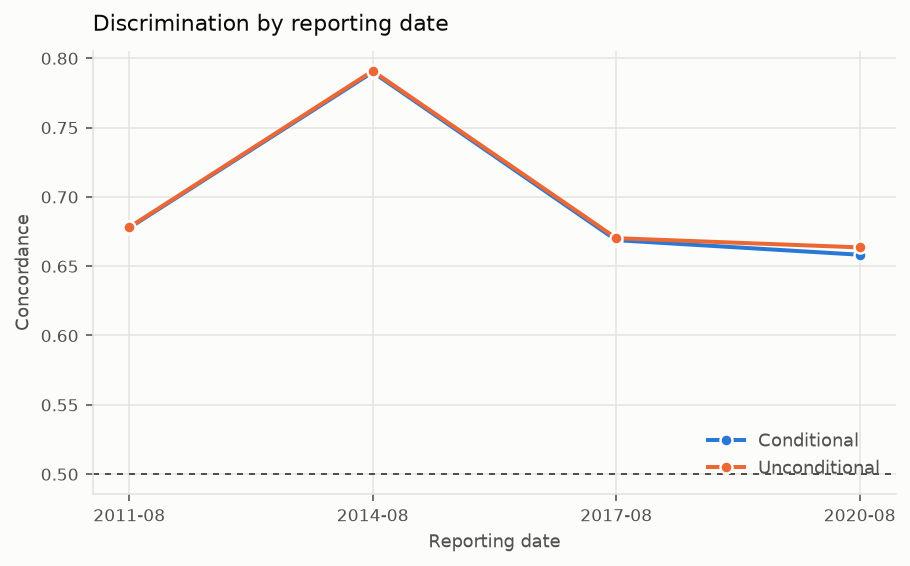

# Backtesting

*Generated by `creditsurv report`. Numbers come from the run, not the prose.*

## Split design

A random split is the wrong default. A credit model is used to write business that
does not exist yet, in an economy that has not happened yet, so the question is
never whether a held-out row can be predicted but whether the model holds up on a
later cohort, or in a later year.

**Every split is truncated in calendar time.** Training on the full history of an
early vintage means training on calendar periods that overlap the test window, so
the model has already seen the conditions it is about to be judged on. That is
look-ahead even though no loan appears in both halves, and it flatters the result
exactly where the model is weakest -- during downturns nobody had seen yet.

- **Out-of-time** -- train on everything known by the reporting date, test on cohorts written after it. The hardest and most realistic test.
- **Out-of-sample** -- a random holdout from the same period. Deliberately the easy split: it isolates estimation noise from regime change, so the gap between it and out-of-time says how much of any degradation is the economy moving rather than the sample being small.
- **Walk-forward** -- the as-of split repeated at successive reporting dates with an expanding window. One holdout says how the model did in one regime; several say whether that was a fluke.

## The two macro modes

**Conditional** feeds the macro path that actually occurred over the test window,
isolating the credit model: given the right economy, does it rank and price
correctly?

**Unconditional** feeds only what was knowable at the reporting date -- a random
walk from the last observation -- and tests the whole system as it would really have
been used, macro forecasting error included.

Reporting only the first overstates what the model can do. Reporting only the
second blames the credit model for the impossibility of forecasting the economy.
The gap between them attributes the error.

We have no vintage-dated macro forecasts, so the unconditional mode uses a random
walk. That is an approximation rather than a reconstruction of what a forecaster
would have said at the time, and it is recorded as one.

## Results

| split | as_of | macro_mode | horizon_months | loans | defaults | concordance | gini | brier | slope | intercept | expected | actual | actual_over_expected | closed_cohort |
|---|---|---|---|---|---|---|---|---|---|---|---|---|---|---|
| walk_forward_2011-08 | 2011-08 | conditional | 24 | 1228 | 43 | 0.6776 | 0.3552 | 0.0524 | 1.6075 | 0.3229 | 0.0567 | 0.0640 | 1.1280 | 672.0000 |
| walk_forward_2011-08 | 2011-08 | unconditional | 24 | 1228 | 43 | 0.6781 | 0.3561 | 0.0522 | 1.5455 | 0.3220 | 0.0594 | 0.0640 | 1.0776 | 672.0000 |
| walk_forward_2014-08 | 2014-08 | conditional | 24 | 1445 | 27 | 0.7900 | 0.5799 | 0.0283 | 1.9180 | 0.2010 | 0.0242 | 0.0299 | 1.2340 | 903.0000 |
| walk_forward_2014-08 | 2014-08 | unconditional | 24 | 1445 | 27 | 0.7908 | 0.5817 | 0.0282 | 1.7531 | 0.1981 | 0.0264 | 0.0299 | 1.1334 | 903.0000 |
| walk_forward_2017-08 | 2017-08 | conditional | 24 | 1464 | 27 | 0.6688 | 0.3375 | 0.0305 | 0.9515 | 0.1280 | 0.0289 | 0.0319 | 1.1047 | 845.0000 |
| walk_forward_2017-08 | 2017-08 | unconditional | 24 | 1464 | 27 | 0.6702 | 0.3404 | 0.0305 | 0.8719 | 0.1269 | 0.0312 | 0.0319 | 1.0247 | 845.0000 |
| walk_forward_2020-08 | 2020-08 | conditional | 24 | 1414 | 36 | 0.6582 | 0.3165 | 0.0446 | 1.1529 | 0.1734 | 0.0349 | 0.0477 | 1.3655 | 755.0000 |
| walk_forward_2020-08 | 2020-08 | unconditional | 24 | 1414 | 36 | 0.6635 | 0.3271 | 0.0446 | 0.6969 | 0.1742 | 0.0583 | 0.0477 | 0.8172 | 755.0000 |

## Where knowing the economy actually matters

The gap between the macro modes appears in **calibration and not in
discrimination**. That is what should happen: a macro path shifts every loan's PD
in the same direction, so the ranking survives and the level does not.

It is worth stating because the natural instinct is to check discrimination first,
and doing so here would conclude that macro forecasting does not matter -- a
statement about the tool rather than about the model.

**Discrimination gap (concordance)**

| split | as_of | conditional | unconditional | gap |
|---|---|---|---|---|
| walk_forward_2011-08 | 2011-08 | 0.6776 | 0.6781 | -0.0005 |
| walk_forward_2014-08 | 2014-08 | 0.7900 | 0.7908 | -0.0009 |
| walk_forward_2017-08 | 2017-08 | 0.6688 | 0.6702 | -0.0014 |
| walk_forward_2020-08 | 2020-08 | 0.6582 | 0.6635 | -0.0053 |

**Calibration gap (actual over expected)**

| split | as_of | conditional | unconditional | gap |
|---|---|---|---|---|
| walk_forward_2011-08 | 2011-08 | 1.1280 | 1.0776 | 0.0504 |
| walk_forward_2014-08 | 2014-08 | 1.2340 | 1.1334 | 0.1006 |
| walk_forward_2017-08 | 2017-08 | 1.1047 | 1.0247 | 0.0801 |
| walk_forward_2020-08 | 2020-08 | 1.3655 | 0.8172 | 0.5483 |

## Calibration by decile of predicted risk

Buckets are quantiles of the prediction, so each holds a similar number of loans
and the tail buckets -- where a model earns or loses its money -- are not one loan
wide. Shown for `walk_forward_2011-08` under the `conditional` macro path.

**Actual against expected by decile**

| bucket | loans | expected | actual | difference | ratio |
|---|---|---|---|---|---|
| 0 | 68 | 0.0135 | 0.0294 | 0.0159 | 2.1727 |
| 1 | 67 | 0.0202 | 0.0000 | -0.0202 | 0.0000 |
| 2 | 67 | 0.0258 | 0.0448 | 0.0190 | 1.7380 |
| 3 | 67 | 0.0309 | 0.0896 | 0.0587 | 2.9017 |
| 4 | 67 | 0.0376 | 0.0000 | -0.0376 | 0.0000 |
| 5 | 67 | 0.0458 | 0.0299 | -0.0159 | 0.6518 |
| 6 | 67 | 0.0551 | 0.0149 | -0.0402 | 0.2709 |
| 7 | 67 | 0.0681 | 0.0896 | 0.0214 | 1.3143 |
| 8 | 67 | 0.0910 | 0.1045 | 0.0134 | 1.1476 |
| 9 | 68 | 0.1781 | 0.2353 | 0.0572 | 1.3213 |

## Population stability

The conventional thresholds -- below 0.1 stable, above 0.25 shifted -- were devised
for **application characteristics**: score, loan size, business mix. Those should
look much the same quarter to quarter, and a jump means something changed about who
is applying.

They do not transfer to macro-driven covariates, which are *designed* to move with
the economy. Train and test come from different calendar periods by construction,
so those covariates score high whenever anything happened. They are labelled rather
than scored, so the figure stays visible and correctly discounted instead of
quietly triggering a model review.

| covariate | psi | kind | interpretation |
|---|---|---|---|
| nfci_lagged | 2.6783 | time-varying | expected to move |
| unemp_gap | 1.8544 | time-varying | expected to move |
| cltv_drift | 0.9009 | time-varying | expected to move |
| refi_incentive | 0.8562 | time-varying | expected to move |
| dti | 0.0168 | static | stable |
| orig_spread | 0.0148 | static | stable |
| log_orig_upb | 0.0105 | static | stable |
| purpose | 0.0081 | static | stable |
| fico_s | 0.0061 | static | stable |
| orig_ltv | 0.0049 | static | stable |
| channel | 0.0047 | static | stable |
| region | 0.0022 | static | stable |
| occupancy | 0.0005 | static | stable |
| first_time_buyer | 2.25e-05 | static | stable |

---

## How this was produced

- `uv run creditsurv backtest` / `creditsurv report`
- 8 split-mode combinations evaluated
- Macroeconomic series are real, from FRED. The loan book is simulated.
