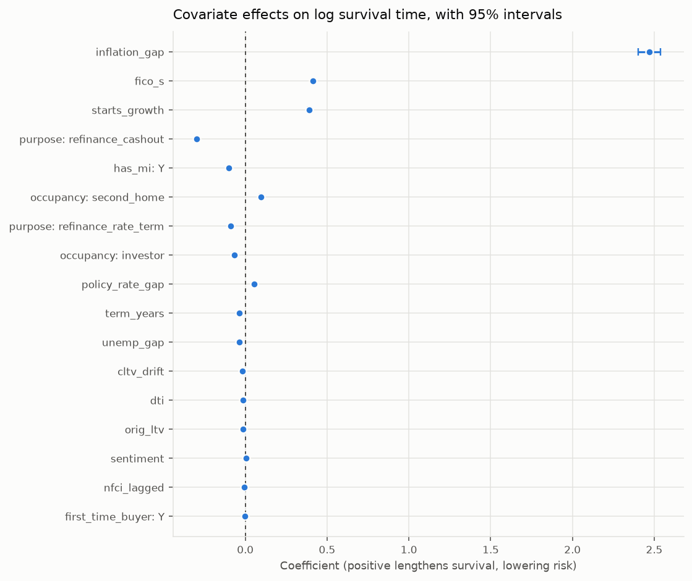
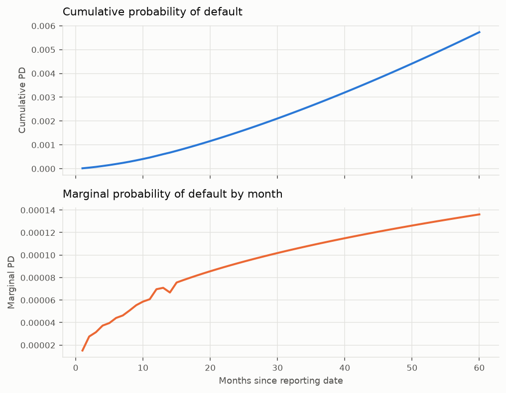
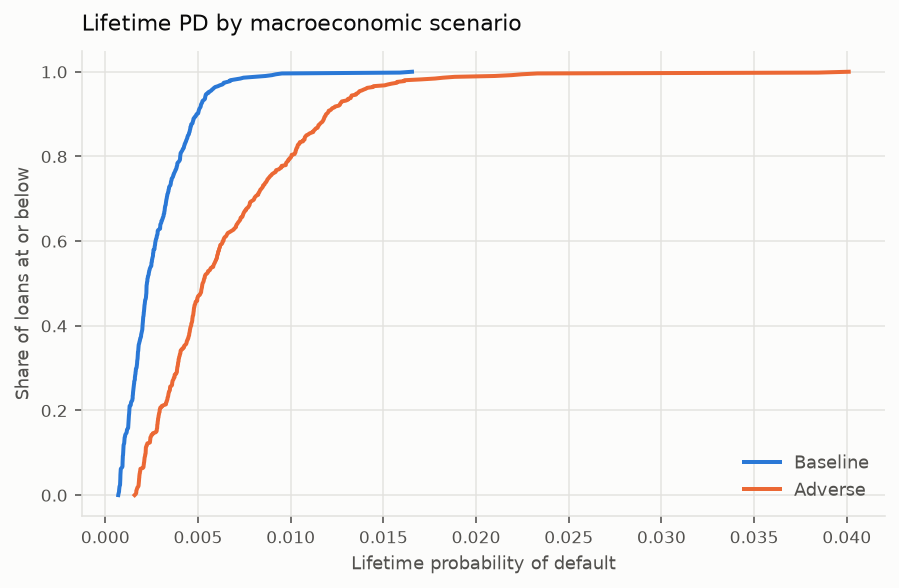

# Calibration: what the regressors are worth

*Generated by `creditsurv report`. Numbers come from the run, not the prose.*

## Reading an AFT coefficient

This is an **accelerated failure time** model, so a coefficient acts on the
logarithm of survival *time*. A positive coefficient lengthens expected survival
and therefore **lowers** risk.

`exp(coef)` is consequently a **time ratio**, not a hazard ratio. A time ratio of
1.4 means a loan is expected to last forty percent longer, not that it is forty
percent more likely to default. Reading the column as a hazard ratio inverts the
sign of every conclusion in this report, which is why the table below names it for
what it is.

## Coefficient estimates

**Coefficients on log survival time**

| param | covariate | coef | se(coef) | time_ratio | coef lower 95% | coef upper 95% | p |
|---|---|---|---|---|---|---|---|
| lambda_ | Intercept | 8.3070 | 0.0079 | 4052.0510 | 8.2914 | 8.3225 | 0.0000 |
| lambda_ | fico_s | 0.4144 | 0.0006 | 1.5135 | 0.4132 | 0.4156 | 0.0000 |
| lambda_ | orig_ltv | -0.0129 | 5.79e-05 | 0.9872 | -0.0130 | -0.0128 | 0.0000 |
| lambda_ | dti | -0.0156 | 5.57e-05 | 0.9845 | -0.0157 | -0.0155 | 0.0000 |
| lambda_ | cltv_drift | -0.0167 | 5.68e-05 | 0.9834 | -0.0169 | -0.0166 | 0.0000 |
| lambda_ | unemp_gap | -0.0353 | 0.0004 | 0.9653 | -0.0360 | -0.0346 | 0.0000 |
| lambda_ | nfci_lagged | -0.0065 | 0.0012 | 0.9935 | -0.0089 | -0.0042 | 4.31e-08 |
| lambda_ | policy_rate_gap | 0.0538 | 0.0004 | 1.0553 | 0.0531 | 0.0546 | 0.0000 |
| lambda_ | sentiment | 0.0068 | 7.16e-05 | 1.0068 | 0.0066 | 0.0069 | 0.0000 |
| lambda_ | starts_growth | 0.3920 | 0.0039 | 1.4799 | 0.3844 | 0.3996 | 0.0000 |
| lambda_ | inflation_gap | 2.4701 | 0.0346 | 11.8242 | 2.4023 | 2.5380 | 0.0000 |
| lambda_ | term_years | -0.0361 | 0.0001 | 0.9646 | -0.0363 | -0.0358 | 0.0000 |
| lambda_ | C(purpose, Treatment('purchase'))[T.refinance_cashout] | -0.2968 | 0.0017 | 0.7432 | -0.3001 | -0.2934 | 0.0000 |
| lambda_ | C(purpose, Treatment('purchase'))[T.refinance_rate_term] | -0.0875 | 0.0017 | 0.9162 | -0.0909 | -0.0841 | 0.0000 |
| lambda_ | C(occupancy, Treatment('owner_occupied'))[T.investor] | -0.0679 | 0.0026 | 0.9343 | -0.0730 | -0.0629 | 1.94e-151 |
| lambda_ | C(occupancy, Treatment('owner_occupied'))[T.second_home] | 0.0960 | 0.0035 | 1.1008 | 0.0892 | 0.1029 | 2.38e-166 |
| lambda_ | C(has_mi, Treatment('N'))[T.Y] | -0.1020 | 0.0019 | 0.9030 | -0.1057 | -0.0984 | 0.0000 |
| lambda_ | C(first_time_buyer, Treatment('N'))[T.Y] | -0.0025 | 0.0021 | 0.9975 | -0.0066 | 0.0016 | 0.2250 |
| rho_ | Intercept | 0.3516 | 0.0007 | 1.4214 | 0.3502 | 0.3531 | 0.0000 |

Interpretation of the two parameter blocks: `lambda_` carries the covariate effects
on the scale of survival time, while `rho_` is the shape of the baseline hazard. A
`rho_` intercept above zero means the hazard *rises* with loan age, which is the
seasoning pattern mortgages are expected to show.

## Marginal effects on probability of default

Coefficients are not comparable across covariates measured in different units, and
a time ratio is not the currency a credit decision is made in. Each row below moves
one covariate by one standard deviation and reports the change in twelve-month PD
in percentage points, holding everything else where it is.

| covariate | kind | one_sd | baseline_pd | shocked_pd | change_pp |
|---|---|---|---|---|---|
| fico_s | static | 1.0482 | 0.0005 | 0.0003 | -0.0223 |
| cltv_drift | time-varying | 10.8488 | 0.0005 | 0.0006 | 0.0143 |
| dti | static | 11.2460 | 0.0005 | 0.0006 | 0.0137 |
| policy_rate_gap | time-varying | 2.3204 | 0.0005 | 0.0004 | -0.0079 |
| orig_ltv | static | 15.7540 | 0.0005 | 0.0006 | 0.0071 |
| unemp_gap | time-varying | 2.6549 | 0.0005 | 0.0006 | 0.0069 |
| sentiment | time-varying | 13.2482 | 0.0005 | 0.0004 | -0.0058 |
| starts_growth | time-varying | 0.1955 | 0.0005 | 0.0004 | -0.0050 |
| inflation_gap | time-varying | 0.0228 | 0.0005 | 0.0004 | -0.0037 |
| nfci_lagged | time-varying | 0.5606 | 0.0005 | 0.0005 | 0.0003 |

## PD term structure

Two portfolios can share a lifetime PD and differ entirely here, and the difference
decides when losses arrive. The cumulative and marginal series are shown in
separate panels rather than on a shared frame with two y-axes: they differ by an
order of magnitude, and a second axis lets the choice of scales decide how related
the two appear.

**Term structure, sampled across the horizon**

| month | survival | cumulative_pd | marginal_pd | hazard |
|---|---|---|---|---|
| 1 | 1.0000 | 1.52e-05 | 1.52e-05 | 1.52e-05 |
| 6 | 0.9998 | 0.0002 | 4.41e-05 | 4.41e-05 |
| 11 | 0.9995 | 0.0005 | 6.08e-05 | 6.08e-05 |
| 16 | 0.9992 | 0.0008 | 7.78e-05 | 7.78e-05 |
| 21 | 0.9988 | 0.0012 | 8.74e-05 | 8.75e-05 |
| 26 | 0.9983 | 0.0017 | 9.58e-05 | 9.6e-05 |
| 31 | 0.9978 | 0.0022 | 0.0001 | 0.0001 |
| 36 | 0.9973 | 0.0027 | 0.0001 | 0.0001 |
| 41 | 0.9967 | 0.0033 | 0.0001 | 0.0001 |
| 46 | 0.9961 | 0.0039 | 0.0001 | 0.0001 |
| 51 | 0.9955 | 0.0045 | 0.0001 | 0.0001 |
| 56 | 0.9948 | 0.0052 | 0.0001 | 0.0001 |

- **12-month PD**: 0.0005
- **lifetime PD (60m)**: 0.0052

## Macroeconomic scenarios

The adverse path is shaped like 2008 rather than scaled to it, and it moves only series the
fitted model reads: each leg is listed below with the move it makes, the month it gets
there, where it stands at three years and the covariates it feeds. The baseline is a random
walk from the last observation, which is **not a forecast** and is not offered as one: it is
what makes the relative effect of a scenario interpretable without smuggling in a view on
the economy.

Twice the scenario and the specification parted company, and twice the report kept
describing a path the model did not see: first two legs fed no covariate and two
covariates had no leg, then the reselection removed volatility and added financial
conditions, the policy rate, sentiment and housing starts. A test now fails whenever the
shocked series and the formula part, and this table is built from the scenario itself.

Because the covariates are time-varying, the scenario is applied by projecting the
covariate paths and chaining conditional survival, not by re-scoring frozen
covariates. That distinction is the whole exercise: an earlier version of this code
advanced calendar time from each loan's origination rather than from the reporting
date, so the projected macro path was never reached and both scenarios returned
almost the same answer. The model looked stable when it was simply not being asked
the question.

**Adverse lifetime PD is 2.39x the baseline.**

**The adverse legs: moves are proportional where shown in per cent**

| series | move | month reached | by month 36 | read by |
|---|---|---|---|---|
| unemployment_rate | +4.0 | 12 | +4.0 | unemp_gap |
| hpi | -20% | 24 | -20% | cltv_drift |
| cpi | -2% | 12 | -2% | inflation_gap |
| nfci | +3.4 | 16 | +0.0 | nfci_lagged |
| policy_rate | -95% | 30 | -95% | policy_rate_gap |
| sentiment | -39% | 16 | -39% | sentiment |
| housing_starts | -65% | 21 | -65% | starts_growth |

**Lifetime PD by scenario**

| statistic | baseline | adverse |
|---|---|---|
| count | 500.0000 | 500.0000 |
| mean | 0.0027 | 0.0066 |
| std | 0.0018 | 0.0044 |
| min | 0.0007 | 0.0016 |
| 25% | 0.0015 | 0.0035 |
| 50% | 0.0022 | 0.0052 |
| 75% | 0.0036 | 0.0088 |
| max | 0.0165 | 0.0401 |

---

## How this was produced

- `uv run creditsurv report`
- Distribution: weibull; likelihood: interval_censored
- Book scored: 500 rows standing for 3,418,486 loans; horizon: 60 months
