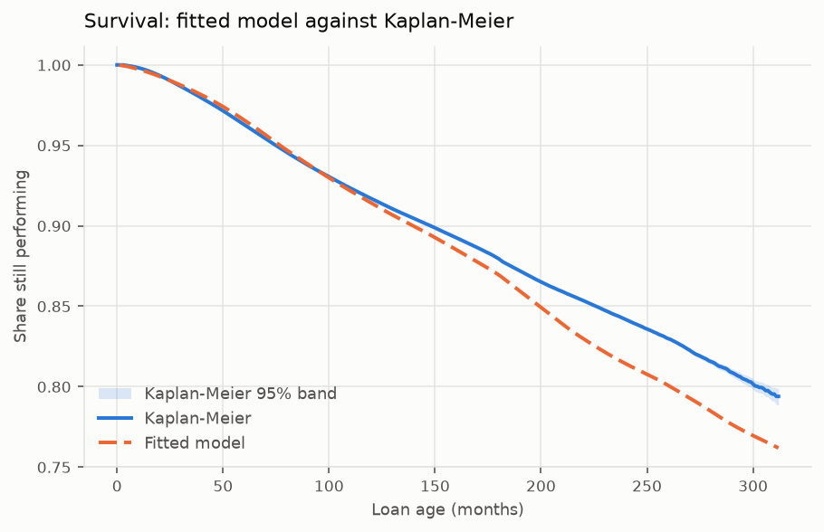

# Methodology, variable selection and fit quality

*Generated by `creditsurv report`. Numbers come from the run, not the prose.*

## Why survival analysis

A default flag answers whether a loan defaulted. Lifetime PD needs to know *when*,
and needs an answer for the loans that have not defaulted yet -- which is most of
them. A classifier discards both: the timing, and the fact that a loan observed for
six months and still performing is evidence about the first six months only.

Survival analysis keeps both. Censoring is a first-class concept rather than a
missing label, and the output is a curve rather than a number, which is what a term
structure of losses is built from.

## Why a parametric model rather than Cox

Lifetime PD needs three things a Cox model does not give:

1. **Extrapolation past the observation window.** A Cox baseline hazard is defined
   only where events were observed; a lifetime PD quoted over a remaining term
   longer than the data has seen requires a functional form.
2. **Response to macroeconomic scenarios.** Pushing a stressed macro path through
   the model requires a hazard that can be evaluated at covariate values that have
   not occurred.
3. **A smooth term structure.** A step function is an awkward basis for a loss
   forecast by month.

The cost is an assumption about the shape of the baseline hazard, which is why the
selection procedure below spends its effort testing that assumption.

## Variable selection

Covariates were chosen from credit reasoning first and tested second, not selected
by a stepwise search. A search over this many correlated covariates would find a
specification that fits this sample and would not survive the next one.

Three exclusions are deliberate and matter more than the inclusions:

- **Origination vintage** is reserved for the out-of-time split. As a covariate it absorbs exactly the macroeconomic effects the model exists to estimate.
- **Contemporaneous macro** is excluded: every series is lagged three months, revised ones because they are published late and market quotes because a loan ninety days delinquent in a month missed its payments in the three before it. Look-ahead is invisible in results -- a model that quietly reads next quarter's unemployment looks excellent and is worthless.
- **Current delinquency status** is excluded as a mediator, not a predictor. Including it inflates every metric while destroying the model's actual use, which is predicting lifetime PD from origination.

Loan-to-value is decomposed rather than indexed. `orig_ltv` and `indexed_cltv` are
*equal* at origination and stay strongly correlated afterwards, so fitting both
gives unstable coefficients. They are split into a level -- `orig_ltv`,
underwriting quality -- and a movement -- `cltv_drift`, how far house prices have
carried the position since, zero at origination by construction.

## Model selection

The intended centrepiece was the generalised gamma, which nests the exponential,
Weibull, gamma, log-normal and inverse-Weibull families, so that one parameter
*tests* which family the data supports rather than ranking candidates by
information criterion. **It is not usable here.**

`GeneralizedGammaRegressionFitter` does not converge on the episode panel under any
remedy tried: penalties from 0.001 to 0.1, durations rescaled, and both L-BFGS-B
and SLSQP. `GeneralizedGammaFitter` on loan-level data nominally converges but
returns a singular Hessian -- standard errors are NaN, lifelines warns against
trusting the parameters, and on data generated from a Weibull process it
estimates the shape parameter at 4.04 where the truth is 1.

An unusable test is worse than no test, so selection rests on five weaker but sound
layers instead.

**Where families nest, they are tested rather than ranked.** An information criterion
is both more expensive and weaker than a hypothesis test, and the exponential nests
inside the Weibull -- so it costs no fit at all, only a Wald test on a parameter the
Weibull fit has already estimated. Only families that genuinely do not nest cost a fit
each.

### 1. Is the hazard constant? No fit required

The exponential is a Weibull with shape one, so the constant-hazard hypothesis is
exactly `log rho = 0` and reads straight off the fitted coefficient table.

**rho = 1.4214, z = 483, p = 0.00e+00.**
The hazard **rises** with loan age, which is the seasoning pattern mortgages are expected to show, and the constant-hazard hypothesis
is settled without estimating anything further.

### 2. Marginal shape, covariate-free

Cheap -- seconds -- and **it does not answer the question it appears to answer.** It is
shown because the obvious reading of it is wrong, and that is worth seeing.

The marginal hazard is not the baseline hazard. On this panel it peaks at about
forty-eight months of loan age, which looks like a seasoning curve and is not: it is
2008 to 2010. Every vintage meets the crisis at a different loan age, so pooling them
smears a calendar event across the age axis and produces a hump belonging to the economy
rather than to the loan.

Slicing the data differently does not repair it, because the obstruction is structural.
Calendar period, origination cohort and loan age satisfy `period = cohort + age`
**identically**, so no two can be held fixed while the third moves. Holding the calendar
fixed at June 2009, the hazard rises to 61 bp at twenty-three months of age and falls to
8 bp at eighty -- and the twenty-three month old loans are the 2007 vintage while the
eighty month old ones are 2002. The profile tracks vintage quality exactly as well as it
tracks age.

This is the age-period-cohort identification problem, and its consequence here is that
**the shape of the baseline hazard is not identified non-parametrically at all.** It
becomes identified only under a restriction, and the restriction this model makes is
that calendar time enters through a handful of macroeconomic covariates rather than as a
free period effect. Which family fits therefore cannot be separated from which
covariates are in the model -- which is why the comparison below, made *with* them, is
the one that decides.

| distribution | log_likelihood | aic | n_parameters | delta_aic |
|---|---|---|---|---|
| lognormal | -1.21e+07 | 2.41e+07 | 2 | 0.00 |
| loglogistic | -1.21e+07 | 2.42e+07 | 2 | 77731.60 |
| weibull | -1.21e+07 | 2.42e+07 | 2 | 91920.15 |
| exponential | -1.22e+07 | 2.45e+07 | 1 | 336551.83 |

### 3. Regression fits on identical episodes

The comparison is made with the covariates and read three ways: the likelihood, the
declared priors -- a family pointing one the wrong way is contradicting the economics
rather than fitting the data -- and the survival curve against Kaplan-Meier, over the long
horizons a lifetime PD is quoted on. The three need not agree, and when they do not the
report says so rather than choosing for the reader. The validation made this comparison on
the specification before it: the log-logistic came 623,126 AIC points behind the Weibull
and turned `orig_ltv`, `term_years` and investor occupancy around. The tables are this
run's own comparison, on this run's specification.

The log-normal is absent because it does not converge on this panel structure --
observed across sample sizes, with and without a penalizer, under two optimisers,
with left truncation on and off, and with durations rescaled. The cause was not
established, so none is claimed; the behaviour is pinned by a strict `xfail` that
will fail the suite if a later lifelines fixes it.

**AIC here counts episodes, not loans**, because that is the unit the likelihood
sums over. It ranks distributions on one panel and means nothing across different
panel constructions -- comparing an interval-censored episode panel with a
loan-level right-censored one by AIC is not a comparison at all.

| distribution | log_likelihood | aic | n_episodes | seconds | signs_against_prior | delta_aic |
|---|---|---|---|---|---|---|
| loglogistic | -1.09e+07 | 2.18e+07 | 59663961 | 4691.30 | nfci_lagged | 0.00 |
| weibull | -1.09e+07 | 2.18e+07 | 59663961 | 562.12 |  | 83961.35 |

On this specification the **loglogistic** has the better likelihood, by 83,961 AIC points.

The loglogistic turns `nfci_lagged` against its declared prior.

Against Kaplan-Meier the **loglogistic** is closer on average, 1.21 percentage points of survival.

The model reported throughout is the weibull, and `docs/variable_selection.md` records why it was kept against a better likelihood.

**Each family against Kaplan-Meier, in percentage points of survival**

| distribution | largest_deviation | mean_deviation | last_month | predicted_survival | deviation_at_last_month |
|---|---|---|---|---|---|
| weibull | 3.26 | 1.26 | 312 | 76.19 | -3.20 |
| loglogistic | 2.90 | 1.21 | 312 | 76.64 | -2.74 |

### 4. Does the hazard's shape vary with covariates?

The default model lets a covariate move *when* default happens while leaving the
shape of the hazard over the life of the loan alone. That is an assumption, and a
nested one, so a likelihood ratio test can say whether relaxing it earns its keep.

It matters for lifetime PD specifically: if the shape genuinely varies, the term
structure differs by loan rather than merely shifting, and a single shape misstates
the timing of losses even when it gets the total right.

Tested on `occupancy`, the one covariate whose survival curves cross: investor loans default faster early and slower late, which no scale factor can represent:

| restricted_log_likelihood | full_log_likelihood | added_parameters | statistic | p_value | restricted_aic | full_aic |
|---|---|---|---|---|---|---|
| -1.09e+07 | -1.09e+07 | 2 | 220.6226 | 1.24e-48 | 2.18e+07 | 2.18e+07 |

### 5. Against the non-parametric estimate

The strongest evidence available, because Kaplan-Meier assumes nothing about the
distribution. A fitted curve straying outside its confidence band is being
contradicted by the data rather than merely smoothing it.

**2 of 312 points fall inside the band** -- and on this panel that
number carries almost no information, which is worth explaining rather than reporting
as a verdict.

A confidence band narrows as the square root of the sample, and on 48 million loans it
collapses. At five years this one runs from 0.9602 to
0.9603 -- a width of **0.0163 percentage
points**, and the median across the horizon is 0.0480. Every smooth
parametric curve is outside a band that narrow, so the in-or-out test answers a question
nobody is asking at this size.

The quantity that does carry information is how far the curve is from the data: **largest
deviation 3.26 percentage points of survival, mean 1.26**,
over a horizon of 312 months. That is what the comparison is for.

This check earned its place. An earlier version of the comparison predicted each
loan's curve from its origination covariates and averaged those, which put only
half the horizon inside the band and overstated five-year survival by eight
percentage points. The cause is that `cltv_drift` and `unemp_gap` are zero at
origination *by construction*, so freezing them there assumes house prices never
move and unemployment never changes. The curve below chains the monthly hazard
along each loan's realised covariate path instead.

**Fitted against observed survival, sampled across the horizon**

| month | predicted | km_lower | km_upper | inside | deviation | band_width |
|---|---|---|---|---|---|---|
| 1.0000 | 0.9999 | 1.0000 | 1.0000 | False | -9.74e-05 | 1.46e-06 |
| 32.0000 | 0.9863 | 0.9852 | 0.9853 | False | 0.0010 | 8.09e-05 |
| 63.0000 | 0.9630 | 0.9602 | 0.9603 | False | 0.0028 | 0.0002 |
| 94.0000 | 0.9349 | 0.9346 | 0.9349 | True | 9.6e-05 | 0.0003 |
| 125.0000 | 0.9103 | 0.9134 | 0.9138 | False | -0.0033 | 0.0003 |
| 156.0000 | 0.8882 | 0.8948 | 0.8953 | False | -0.0068 | 0.0005 |
| 187.0000 | 0.8625 | 0.8737 | 0.8745 | False | -0.0116 | 0.0007 |
| 218.0000 | 0.8315 | 0.8540 | 0.8551 | False | -0.0231 | 0.0011 |
| 249.0000 | 0.8083 | 0.8355 | 0.8371 | False | -0.0280 | 0.0016 |
| 280.0000 | 0.7848 | 0.8139 | 0.8174 | False | -0.0308 | 0.0035 |
| 311.0000 | 0.7625 | 0.7887 | 0.7990 | False | -0.0313 | 0.0103 |

## Fit summary

- **distribution**: weibull
- **likelihood**: interval_censored
- **episodes**: 59663961
- **defaults**: 1460306
- **log-likelihood**: -1.09e+07
- **AIC (episode scale)**: 2.18e+07
- **fit seconds**: 562.12

---

## How this was produced

- `uv run creditsurv report`
- Formula: `fico_s + orig_ltv + dti + cltv_drift + unemp_gap + nfci_lagged + policy_rate_gap + sentiment + starts_growth + inflation_gap + term_years + C(purpose, Treatment('purchase')) + C(occupancy, Treatment('owner_occupied')) + C(has_mi, Treatment('N')) + C(first_time_buyer, Treatment('N'))`
- Loan data: Freddie Mac Single-Family Loan-Level Dataset. Macro: FRED; see `docs/data_dictionary.md`.
