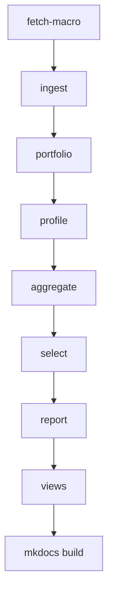
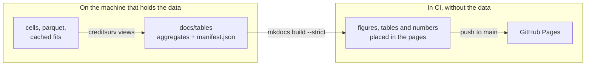

# Reproduce

Everything runs on one laptop: 8 cores and 16 GB of memory. The times below were measured
on it.

## The pipeline



| Command | What it does | Cost |
|---|---|---|
| `uv sync --group docs` | installs the package, the tools and the site builder | -- |
| `uv run creditsurv fetch-macro` | downloads the FRED series, no API key | seconds |
| `uv run creditsurv ingest` | 40 GB of archives to 17 GB of parquet, idempotent | ~30 min |
| `uv run creditsurv portfolio` | describes the book: static figures and `portfolio_summary.json` | minutes |
| `uv run creditsurv profile` | screens the covariates before aggregating | minutes |
| `uv run creditsurv aggregate --moratorium exclude` | collapses the book into weighted cells | ~40 min, 11.3 GB peak |
| `uv run creditsurv select` | steps 5 to 9 on the training half; resumes from its cache | ~4.5 h from cached screening fits |
| `uv run creditsurv report --extra-fits` | one fit and the three reports | ~2.5 h with the family and shape fits |
| `uv run creditsurv views` | scores the cached fit and writes `docs/tables`; never fits | ~80 min, footprint near 15 GB |
| `uv run mkdocs serve` | this site, locally | seconds |

The dataset cannot be downloaded programmatically: registration is free but manual, at
[Freddie Mac's Clarity portal](https://claritydownload.fmapps.freddiemac.com/CRT/). Nothing in
this repository touches the network for it.

The checks the independent validation asked for are commands of their own:

```bash
uv run creditsurv aggregate --moratorium censor   # the other event definition (D1)
uv run creditsurv moratorium                      # both fitted and backtested, side by side
uv run creditsurv aggregate --report-incomplete   # the loans the cells leave out (D4)
uv run creditsurv aggregate --report-exits        # what censoring codes 16 and 96 rests on (D5)
uv run creditsurv check-calendar                  # defaults by month, cells against files (M1)
```

## How the site is built



The data cannot reach CI, so the views are computed locally and committed, and the site is
built from them. The manifest records which fit produced every model view, and the build
fails if the views come from more than one. A page places a figure, a table or a number with
a placeholder, never by typing it:

```markdown
<!-- figure: km_vs_model -->
<!-- table: acceptance -->
The out-of-time ratio is <!-- value: backtest.ae -->.
```

A placeholder that names nothing, or a view the manifest does not list, fails the build.

## Constraints worth knowing before a long run

!!! danger "Irreversible"
    `creditsurv prune-archives` deletes the 40 GB of downloads. It is a separate command,
    never appended to the ingest, and verifies per quarter that the manifest records the
    ingest finished, both parquet files exist, and their row counts still match.

- **Memory decides what can be fitted.** The training half is 59.7 million cells. A cold
  Weibull fit on it took 91 minutes; warm-started from the selection, 9.4. Never hold the
  panel beside its halves: they are built from the cells one at a time.
- **One heavy job at a time.** Aggregation peaks at 11.3 GB, scoring the training half near
  the machine's limit.
- **Measure memory as the physical footprint**, not the resident set size, which misses
  compressed pages and understated a fit about 2.5 times.
- **A fit is saved the moment it succeeds.** One run completed a 154-minute fit and was
  killed writing its reports, keeping nothing.
- **Long runs belong in a detached session** that prevents sleep, such as
  `screen -dmS name caffeinate -i uv run creditsurv ...`.

## Development

```bash
uv run ruff check . && uv run ruff format --check .
uv run mypy                        # strict
uv run pytest -m "not network"
uv run mkdocs build --strict
```

Tests use fixtures written in Freddie Mac's own pipe-delimited format, so the loader runs on
every test that needs data. CI runs lint, format, strict type checking, the tests and a
packaging build on Python 3.11 and 3.12; the site is built on every pull request and
published on every merge to `main`.
