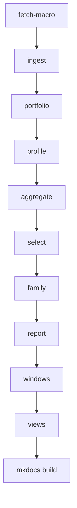
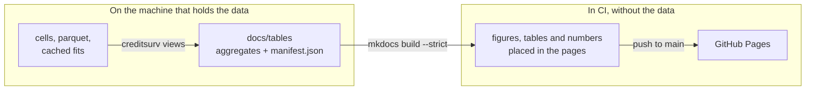

# Reproduce

Everything runs on one laptop: 8 cores and 16 GB of memory. The times below were measured
on it.

## The pipeline


```mermaid
flowchart TD
    A["fetch-macro"] --> B["ingest"] --> C["portfolio"] --> D["profile"] --> E["aggregate"]
    E --> F["select"] --> G["family"] --> H["report"] --> I["windows"] --> J["views"]
    J --> K["mkdocs build"]
```

| Command | What it does | Cost |
|---|---|---|
| `uv sync --group docs` | installs the package, the tools and the site builder | -- |
| `uv run creditsurv fetch-macro` | downloads the FRED series, no API key | seconds |
| `uv run creditsurv ingest` | 40 GB of archives to 17 GB of parquet, idempotent | ~30 min |
| `uv run creditsurv portfolio` | describes the book: static figures and `portfolio_summary.json` | minutes |
| `uv run creditsurv profile` | screens the covariates before aggregating | minutes |
| `uv run creditsurv profile --extensions` | prices each extension of the cell key on nine quarters | ~3.5 h |
| `uv run creditsurv aggregate --moratorium exclude` | collapses the book into weighted cells | ~40 min, 11.3 GB peak |
| `uv run creditsurv select` | steps 5 to 10 on the training half; resumes from its cache | **~3.5 h**; three readings, 2.9 GB |
| `uv run creditsurv select --dist loglogistic` | the same procedure through the other family | hours |
| `uv run creditsurv select --cause prepayment` | the competing model, under rule 6's priors | hours |
| `uv run creditsurv family` | applies rule 2 and writes the verdict; fits nothing | ~1 h |
| `uv run creditsurv report --extra-fits` | one fit and the three reports | under an hour, plus the shape fit, which is traced |
| `uv run creditsurv windows` | three cuts, the anchoring and the grades | ~1 h; one fit per cut, each warm |
| `uv run creditsurv views` | scores the cached fit and writes `docs/tables`; never fits | two passes over the cell file |
| `uv run mkdocs serve` | this site, locally | seconds |

The dataset cannot be downloaded programmatically: registration is free but manual, at
[Freddie Mac's Clarity portal](https://claritydownload.fmapps.freddiemac.com/CRT/). Nothing in
this repository touches the network for it.

The checks the independent validation asked for are commands of their own:

```bash
uv run creditsurv aggregate --moratorium censor   # the other event definition (D1)
uv run creditsurv moratorium                      # both fitted and backtested, side by side
uv run creditsurv aggregate --report-incomplete   # the loans the cells leave out (D4)
uv run creditsurv aggregate --report-exits        # what censoring codes 16 and 96 rests on (D5)
uv run creditsurv check-calendar                  # defaults by month, cells against files (M1)
```

## How the site is built


```mermaid
flowchart LR
    subgraph local["On the machine that holds the data"]
        A["cells, parquet,<br/>cached fits"] -->|"creditsurv views"| B["docs/tables<br/>aggregates + manifest.json"]
    end
    subgraph ci["In CI, without the data"]
        B -->|"mkdocs build --strict"| C["figures, tables and numbers<br/>placed in the pages"]
        C -->|"push to main"| D["GitHub Pages"]
    end
```

The data cannot reach CI, so the views are computed locally and committed, and the site is
built from them. The manifest records which fit produced every model view, and the build
fails if the views come from more than one. A page places a figure, a table or a number with
a placeholder, never by typing it:

```markdown
<!-- figure: km_vs_model -->
<!-- table: acceptance -->
The out-of-time ratio is <!-- value: backtest.ae -->.
```

A placeholder that names nothing, or a view the manifest does not list, fails the build.

## What a selection costs

The record the last selection wrote counts its own work: <!-- value: selection.fits --> fits,
<!-- value: selection.minutes --> minutes of them, of which <!-- value: selection.cached --> came
back from the cache rather than being estimated again. Every fit is saved the moment it succeeds,
so a run that is interrupted resumes at the fit it was on, and a fit whose specification and rows
are unchanged is never paid for twice.

## Constraints worth knowing before a long run

!!! danger "Irreversible"
    `creditsurv prune-archives` deletes the 40 GB of downloads. It is a separate command,
    never appended to the ingest, and verifies per quarter that the manifest records the
    ingest finished, both parquet files exist, and their row counts still match.

    `creditsurv prune-encodings` is the smaller sibling: a cached reading of the cell file is
    **1.0 GB** and is named by the table's identity, so rebuilding the table leaves every
    reading of the old one as dead weight nothing will ever look for again -- six per campaign
    of rule 2. It sweeps only those, shows what would go, and asks; a reading of the table on
    disk is kept unless `--no-stale-only` says otherwise, because that one costs 11.6 minutes
    to take again.

- **Nothing holds the panel any more.** The training half is 72.7 million cells, and every
  command that used to expand it now reads the cell file a batch at a time: the fits, the
  selection, the views and the backtest windows.
- **The reading is paid once per table, not once per run.** It used to be once per candidate,
  about thirty times a selection; then once per *sample*, three times; and now it is **written
  to disk and mapped back in 0.4 seconds against 693.9**. Each reading keeps **fifteen bytes a
  row**, 1.09 GB for the whole half and 1.0 GB on disk, and a candidate's design is two tables
  built from the keys -- 3,001 loan combinations and 152,565 calendar for the published model,
  286,387 for a reading that covers every candidate. A run that stops picks up at the fit it
  was on rather than at the reading.
- **A cold fit is 10.2 minutes, not 43.8**, and about 4 with the compiled kernel. Damped Newton
  goes first now; a Hessian costs about twice a value-and-gradient where it used to cost 49
  times a value, so 16 evaluations replace 142. A selection run is about **1.5 to 2 hours**
  where the four recorded runs averaged 10.5. `--traced` on `select`, `fit` and `report` goes
  back to tracing lifelines' likelihood with autograd in `--workers` processes, which is the
  path the equivalence tests hold the other to and the only one that can fit a shape with
  covariates. `docs/reports/engine.md` carries every number.
- **The compiled kernel is optional, and this machine's runs use it.** `uv sync --extra kernel`
  builds `crates/creditsurv-kernel`; without it everything works through the NumPy kernel, which
  is normative. It is **2.80x** on a Hessian and 1.57x on a value-and-gradient, kept under an
  exception declared beside rule 13, and it agrees with the NumPy to 1.2e-15 on the objective
  on the production table. Nobody needs a Rust toolchain to run this project.
- **A window is read, not filtered.** `load_cells_window` selects on the observation month --
  origination plus age, so not a column parquet can be asked about by name -- inside DuckDB.
  Two years of observation are about 3% of the table.
- **One heavy job at a time.** Aggregation still peaks at 11.3 GB, and it is now the largest
  thing in the pipeline.
- **Measure memory as the physical footprint**, not the resident set size, which misses
  compressed pages and understated a fit about 2.5 times.
- **A fit is saved the moment it succeeds.** One run completed a 154-minute fit and was
  killed writing its reports, keeping nothing.
- **Long runs belong in a detached session** that prevents sleep, such as
  `screen -dmS name caffeinate -i uv run creditsurv ...`.

## Development

```bash
uv run ruff check . && uv run ruff format --check .
uv run mypy                        # strict
uv run pytest -m "not network"
uv run mkdocs build --strict
```

Tests use fixtures written in Freddie Mac's own pipe-delimited format, so the loader runs on
every test that needs data. CI runs lint, format, strict type checking, the tests and a
packaging build on Python 3.11 and 3.12; the site is built on every pull request and
published on every merge to `main`.
