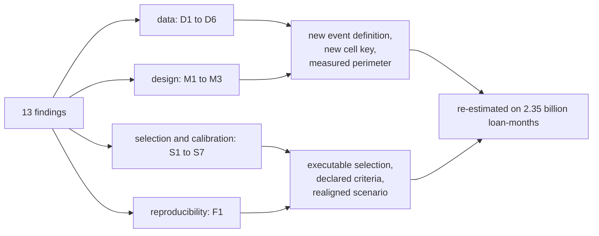

# Validation response

An independent validation of the model at commit `ae582e5` (12 September 2026) raised
thirteen findings: six on the data (D), three on the model design (M), seven on selection and
calibration (S) and one on reproducibility (F). Three were rated high: **D1/D2**, forbearance
counted as default; **M1**, a two-month calendar misattribution; and **S2**, a stress scenario
that did not move the covariates the model reads.

All thirteen were addressed in one change, and every model was re-estimated on the whole
training half, without sampling.

| Finding | What changed | Measured | Evidence |
|---|---|---|---|
| **D1, D2** moratoria counted as defaults | A moratorium is not a default (`MoratoriumPolicy`); the three fields that identify one are kept at ingest. `exclude` chosen over `censor` by a rule written before either fit | May 2020 default rate from 90.4 to **2.00 bp**; censoring would have lost 26% of the test window's defaults | [Moratorium report](reports/moratorium.md), [data preparation](data_preparation.md#a-moratorium-is-not-a-default) |
| **D3** late entries | Measured and warned about, not absorbed | -- | [Data preparation](data_preparation.md#loans-enter-late-and-the-likelihood-is-told) |
| **D4** incomplete cases | Profiled over every vintage: almost all are HARP refinances, which carry no debt-to-income | 18% of the 2009Q2 to 2019Q1 loans, 2.9 times the default rate; stated as outside the model | [Data](data.md#what-is-out-of-scope) |
| **D5** exit codes 16 and 96 | Classified as censoring, and what that rests on measured | 90.1% of reperforming sales had defaulted first | [Data preparation](data_preparation.md#event-definition) |
| **D6** `super_conforming_flag` | Mapped from what the field holds | -- | [Data dictionary](data_dictionary.md) |
| **M1** calendar two months late | The exact origination month in the cell key | 0 of 1,536,686 defaults filed in a different month; the correlation peaks at lag zero | [Data preparation](data_preparation.md#the-grouping-key) |
| **M2** two grids of cut points | One production grid, held by a test to a subset of the exploratory one | -- | [Data preparation](data_preparation.md#cut-points) |
| **M3** loan characteristics kept out of the key | Mortgage insurance and buyer type in the key and screened into the model | 1.19 times the cells, where sixteen had been claimed | [Variable selection](variable_selection.md#running-it-creditsurv-select) |
| **F1, S5** the specification could not be regenerated; levels as calendar effects | `creditsurv select` runs steps 5 to 9 and produces the specification, which a test holds the configuration to; gap forms offered beside levels; the reversal rule runs | 7 macro covariates kept; equity volatility and inflation removed by the procedure | [Methodology](methodology.md#how-the-covariates-were-chosen), [selection record](reports/selection.md) |
| **S1** a backtest with no criterion | Acceptance criteria declared before the run; in-sample actual over expected by year beside the out-of-time figure | Overall ratio and Gini pass; **deciles fail** | [Calibration & backtest](calibration.md) |
| **S2** scenario misaligned | The adverse path moves only series the model reads, and its table is built from the scenario | Adverse lifetime PD 2.39 times baseline | [Model](model.md#scenarios) |
| **S3** family and shape untested | Distribution comparison with a sign check, and the shape test on occupancy, both run | The log-logistic leads on likelihood; the shape varies with occupancy | [Methodology](methodology.md#the-distribution-family) |
| **S4, S6, S7** lags, marginal effects, figures | Every macro series lagged; marginal effects and event count fixed; figures aligned across documents | -- | [Data](data.md), [portfolio](portfolio.md) |

The measured column records the figures of the re-estimation that closed the findings.
The current figures are on the pages linked beside them.

## Found along the way

- **The block fit engine.** A stock lifelines fit needs 45 to 50 GB on the exact key; fits
  now run block by block on lifelines' own likelihood, polished to the optimum lifelines'
  optimiser stops up to 5.9 standard errors short of.
- **An undamped warm start** stepped into the region where lifelines' clipped likelihood goes
  negative and could have reported it as the optimum; the polish is now damped and refuses
  values no likelihood can take, which also took a screening fit from 76 minutes to 30.
- **The selection's inputs no longer come from its output**, and `report` starts its fit
  where the selection ended.

## Still open

| | Why it is open |
|---|---|
| **Decile calibration** | The declared criterion fails: out of time, actual over expected runs from <!-- value: backtest.deciles --> across the deciles |
| **Weibull or log-logistic** | The log-logistic has the better likelihood but turns *financial conditions* against its prior; switching means a selection run with log-logistic fits |
| **Prepayment** | Independent censoring, so lifetime PD is overstated at long horizons |
| **HARP** | Outside the model; covering it needs a level of its own in the key |
| **Point-in-time macro** | FRED serves revised series |

These are the subject of the next stage of the model: prepayment as a competing risk,
payment history, HARP inside the key, a family rule written before the fits, and a
calibration anchored on a window of its own. See the [decision log](decisions.md).
