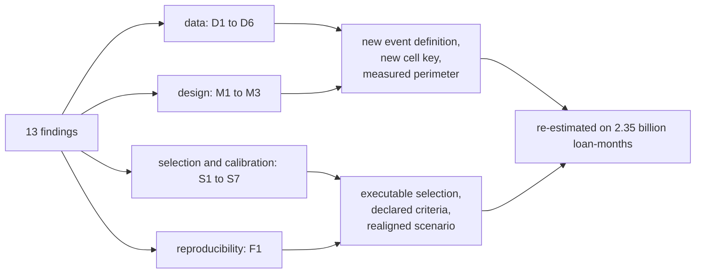

# Validation response

An independent validation of the model at commit `ae582e5` (12 September 2026) raised
thirteen findings: six on the data (D), three on the model design (M), seven on selection and
calibration (S) and one on reproducibility (F). Three were rated high: **D1/D2**, forbearance
counted as default; **M1**, a two-month calendar misattribution; and **S2**, a stress scenario
that did not move the covariates the model reads.

All thirteen were addressed in one change, and every model was re-estimated on the whole
training half, without sampling.

```mermaid
flowchart LR
    V["13 findings"] --> D["data: D1 to D6"]
    V --> M["design: M1 to M3"]
    V --> S["selection and calibration: S1 to S7"]
    V --> F["reproducibility: F1"]
    D --> R["new event definition,<br/>new cell key,<br/>measured perimeter"]
    M --> R
    S --> P["executable selection,<br/>declared criteria,<br/>realigned scenario"]
    F --> P
    R --> O["re-estimated on 2.35 billion loan-months"]
    P --> O
```

| Finding | What changed | Measured | Evidence |
|---|---|---|---|
| **D1, D2** moratoria counted as defaults | A moratorium is not a default (`MoratoriumPolicy`); the three fields that identify one are kept at ingest. `exclude` chosen over `censor` by a rule written before either fit | May 2020 default rate from 90.4 to **2.00 bp**; censoring would have lost 26% of the test window's defaults | [Moratorium report](reports/moratorium.md), [data preparation](data_preparation.md#a-moratorium-is-not-a-default) |
| **D3** late entries | Measured and warned about, not absorbed | -- | [Data preparation](data_preparation.md#loans-enter-late-and-the-likelihood-is-told) |
| **D4** incomplete cases | Profiled over every vintage: almost all are HARP refinances, which carry no debt-to-income | 18% of the 2009Q2 to 2019Q1 loans, 2.9 times the default rate; stated as outside the model | [Data](data.md#what-is-out-of-scope) |
| **D5** exit codes 16 and 96 | Classified as censoring, and what that rests on measured | 90.1% of reperforming sales had defaulted first | [Data preparation](data_preparation.md#event-definition) |
| **D6** `super_conforming_flag` | Mapped from what the field holds | -- | [Data dictionary](data_dictionary.md) |
| **M1** calendar two months late | The exact origination month in the cell key | 0 of 1,536,686 defaults filed in a different month; the correlation peaks at lag zero | [Data preparation](data_preparation.md#the-grouping-key) |
| **M2** two grids of cut points | One production grid, held by a test to a subset of the exploratory one | -- | [Data preparation](data_preparation.md#cut-points) |
| **M3** loan characteristics kept out of the key | Mortgage insurance and buyer type in the key and screened into the model | 1.19 times the cells, where sixteen had been claimed | [Variable selection](variable_selection.md#running-it-creditsurv-select) |
| **F1, S5** the specification could not be regenerated; levels as calendar effects | `creditsurv select` runs steps 5 to 9 and produces the specification, which a test holds the configuration to; gap forms offered beside levels; the reversal rule runs | 7 macro covariates kept; equity volatility and inflation removed by the procedure | [Methodology](methodology.md#how-the-covariates-were-chosen), [selection record](reports/selection.md) |
| **S1** a backtest with no criterion | Acceptance criteria declared before the run; in-sample actual over expected by year beside the out-of-time figure | Overall ratio and Gini pass; **deciles fail** | [Calibration & backtest](calibration.md) |
| **S2** scenario misaligned | The adverse path moves only series a model reads, and every series a model reads -- now across **both** hazards, since the lifetime PD chains two. Its table is built from the scenario rather than described beside it | 11 series shocked, 11 covariates moved, neither set larger than the other | [Model](model.md#scenarios) |
| **S3** family and shape untested | Distribution comparison with a sign check, and the shape test on occupancy, both run | The log-logistic leads on likelihood; the shape varies with occupancy | [Methodology](methodology.md#the-distribution-family) |
| **S4, S6, S7** lags, marginal effects, figures | Every macro series lagged; marginal effects and event count fixed; figures aligned across documents | -- | [Data](data.md), [portfolio](portfolio.md) |

The measured column records the figures of the re-estimation that closed the findings.
The current figures are on the pages linked beside them.

## Found along the way

- **The block fit engine.** A stock lifelines fit needs 45 to 50 GB on the exact key; fits
  now run block by block on lifelines' own likelihood, polished to the optimum lifelines'
  optimiser stops up to 5.9 standard errors short of.
- **An undamped warm start** stepped into the region where lifelines' clipped likelihood goes
  negative and could have reported it as the optimum; the polish is now damped and refuses
  values no likelihood can take, which also took a screening fit from 76 minutes to 30.
- **The selection's inputs no longer come from its output**, and `report` starts its fit
  where the selection ended.
- **lifelines' clipped likelihood is unbounded below, and every optimiser finds it.** The
  interval probability is clipped at 1e-25 while the left-truncation term is added unclipped, so
  the objective -- a mean negative log-likelihood, which cannot be negative -- can fall below
  anything a likelihood can take. It needs no extreme parameter: on the prepayment model the
  truncation term has only to reach 0.0176 on the mean, the order of the hazard itself. A
  nested fit is now handed its parent's optimum as a floor, that region is returned as infinite
  with a zero gradient so every method backtracks from it, and the shape is bounded at 3 on the
  log scale, where 125 converged fits on this book put it between 1.07 and 1.62.
- **A fit was not reproducible.** One queue served every worker process, so the parent added
  their shares in the order they arrived; floating-point addition is not associative, and the
  optimiser turned the last digit into a different search. Two runs of one fit agreed to every
  printed digit for eighty evaluations, split at 0.065288491918 against 0.065288491919, and were
  five significant figures apart forty later. The shares are added in the parts' own order now,
  and a test compares three runs bit for bit.
- **A diagnosis that did not survive its own test**, recorded because it is easy to reach
  again: that a polish stalling 557 standard errors out means a flat direction. The two
  quantities the comparison needed are identically equal, so the ratio reads one whatever the
  curvature. What the stall meant was the floor above.

## What the next stage closed

Four of the five open items are closed, each by the thing the decision log said would close it.

| | How it closed | Measured |
|---|---|---|
| **Prepayment** | A competing risk with a model of its own, selected by the same procedure under rule 6's priors. Lifetime PD is a cumulative incidence rather than `1 - S` | 33,797,300 prepayments beside 1,671,207 defaults; 17 covariates from 24 candidates |
| **Weibull or log-logistic** | Rule 2, written before either fit and applied by `creditsurv family`: each family's **own** selected model against the Aalen-Johansen incidence. Neither turns a declared sign, so neither is excluded | Weibull 0.1027 pp mean gap against the log-logistic's 0.1498, over 222 loan ages |
| **HARP** | A level in the key. The missing debt-to-income and the programme are the same set, so the ratio stays missing and the level absorbs the constant that fills it -- the dummy-variable adjustment, not an imputation | 238,849,701 loan-months, 8.6% of the book, 135,070 defaults |
| **Payment history** | The state of the month **before** is in the key, since the state during the month is the event by definition | 1,518,761 of 1,671,207 defaults open the month two payments behind |

And the level is anchored on a window of its own, which was the other half of the plan: one
multiplier of 1.1831 estimated on 2022-01 to 2024-12 takes the test window's actual over
expected from 1.134 to **0.958** with the Gini untouched at 0.541, because it moves the level
and nothing else.

## Still open

| | Why it is open |
|---|---|
| **Decile calibration** | Still failing, and now diagnosed rather than merely reported. The model's **risk spread is compressed**: in sample it predicts 74.4x between the riskiest tenth of exposure and the safest where the book realises 125.3x, so actual over expected rises monotonically from 0.59 to 1.20 across the deciles. A multiplier cannot mend it, because the error is a slope. Rule 12 found the first cause -- three banded covariates read as a straight line through their midpoints -- and reading them as bands recovered **10.2%** of the gap. The rest is resolution: the key carries five score bands with 45.67% of the exposure in the top one, finer bands cost 2.276x the base key, and with the HARP level that rule 8 makes obligatory that is 154 million cells against the 150 million ceiling rule 7 declared |
| **The level across regimes** | Actual over expected runs 0.458, 0.823 and 1.420 across the three declared cuts, in opposite directions. This is the identification restriction, not a fit: `period = cohort + age` holds identically, so calendar time enters only through six macro covariates, and a regime driven by another channel -- a moratorium suppressing the event in 2019-20, affordability in 2023-24 -- mis-levels the model. The anchoring is the declared remedy and it works on the window it is estimated on; by construction it cannot cover a regime it has not seen |
| **Point-in-time macro** | FRED serves revised series. ALFRED's vintages were attempted and need an API key, so the limit is documented rather than closed |

The two calibration items are what the next two branches are for: a compiled numerical core, so
that a larger key can be fitted at all, and then the finer bands and a re-selection under them.
The ceiling itself will be re-declared from the measured capacity of that engine, before the
table is rebuilt, rather than raised to fit what it needs to admit.
